# UC-001: Normal Order Processing - System Workflow

## Process Steps

### 1. Received Order from Kafka
Order received via Kafka Order Create topic

### 2. Check Order Exist?
- **If Yes:** Route to update order flow
- **If No:** Continue to validation

### 3. Validation Fields
**Required Fields:**
**Rule A:** OrderID - Unique identifier validation  
**Rule B:** ShipFromLocationID - Consistency across all line items  
**Rule C:** IsForceAllocation - Must be set to True

**Optional Fields:**
**Rule D:** T1MembershipID - Optional, required for fulfillment center operations  
**Rule E:** T1Number - Optional, fulfillment center reference identifier  
**Rule F:** CustRef - Optional, Slick integration reference  
**Rule G:** CustomerID - Optional, MAO customer profile validation

### 4. Data Enrichment
- Auto-enhance ShortDescription for blank attributes
- Auto-enhance ImageURL for blank attributes
- Order ID naming convention standardization
- Product catalog integration

### 5. Calculation Logic
**Cal A:** SubTotal - Sum of all line item totals  
**Cal B:** TotalCharge - SubTotal + taxes + fees  
**Cal C:** OrderTotal - Final order amount  
**Cal D:** TotalDiscount - Applied discounts  
**Cal E:** TotalTaxes - Tax calculations  
**Cal F:** Informational Taxes - Additional tax information

**Financial Precision:**
- Store as 4-digit decimal, display as 2-digit precision (DECIMAL(18,4))
- Shipping fee proration excluded for QC SMF implementation

### 6. Force Allocation
- Stock validation bypassed (IsForceAllocation=True)
- Allocate from ShipFromLocationID
- Status: 2000 (Allocated)

### 7. Payment
- All orders: COD (Cash on Delivery)
- Payment Status: 5000 "Paid" (QC SMF exclusive)

### 8. Release
- Force One Release per order
- Publish release event
- Status: 3000 (Released)
- T1 Member Attribution required for POS integration

### 9. Slick REST API Integration
- **API Call Trigger:** Order release completion (Status 3000 Released)
- **API Endpoint:** `POST /api/fulfillment/ship-events`
- **Request Payload:**
  ```json
  {
    "orderId": "string",
    "shipFromLocationId": "string", 
    "eventType": "shipped",
    "timestamp": "ISO8601",
    "trackingInfo": {
      "trackingId": "string",
      "carrierId": "string"
    }
  }
  ```
- **Success Response (200):**
  - Update order status to 7000 (Fulfilled)
  - Generate tracking information
  - Notify customer of shipment
- **Failure Response (4xx/5xx):**
  - Retry mechanism (3 attempts with exponential backoff)
  - Alert operations team
  - Maintain order in Released status for manual intervention

## System Workflow Diagram

```mermaid
flowchart TD
 subgraph subGraphA["Order Creation"]
        A["Received Order from Kafka"]
  end
 subgraph subGraphB["Order Check"]
        B{"Check Order Exist?"}
        B1["Update Existing Order"]
  end
 subgraph subGraphC["Validation Layer"]
        C["Validation Fields"]
        C1["Rule A: OrderID validation"]
        C2["Rule B: ShipFromLocationID consistency"]
        C3["Rule C: IsForceAllocation = True"]
        C4["Rule D: T1MembershipID (Optional)"]
        C5["Rule E: T1Number (Optional)"]
        C6["Rule F: CustRef (Optional)"]
        C7["Rule G: CustomerID (Optional)"]
        D{"All Rules Valid?"}
        E["Return Error - Missing Required Field"]
  end
 subgraph subGraphD["Data Processing"]
        F["Data Enrichment<br>• ShortDescription: Frontend enrichment for blank attributes<br>• ImageURL: Frontend enrichment for blank attributes<br>• Naming convention standardization"]
  end
 subgraph subGraphE["Calculation Layer"]
        G["Calculation Logic"]
        G1["Cal A: SubTotal"]
        G2["Cal B: TotalCharge"]
        G3["Cal C: OrderTotal"]
        G4["Cal D: TotalDiscount"]
        G5["Cal E: TotalTaxes"]
        G6["Cal F: Informational Taxes"]
  end
 subgraph subGraphF["Allocation Layer"]
        H["Force Allocation<br>• Stock validation bypassed<br>• Allocate from ShipFromLocationID<br>• Status: Allocated"]
  end
 subgraph subGraphG["Payment Layer"]
        I["Payment<br>• Type: COD<br>(Cash on Delivery)<br>• Status: Paid"]
  end
 subgraph subGraphH["Fulfillment Layer"]
        J["Release<br>• Force One Release per order<br>• Publish release event<br>• Status: Released"]
        K["Slick Call API<br>• Update ship event<br>• Mark to Fulfilled<br>• Status: Fulfilled"]
  end
 subgraph subGraphI["Output Layer"]
        L["Return Success Response"]
  end
    A --> B
    B -- Yes --> B1
    B -- No --> C
    B1 --> C
    C --> C1
    C1 --> C2
    C2 --> C3
    C3 --> C4
    C4 --> C5
    C5 --> C6
    C6 --> C7
    C7 --> D
    D -- No --> E
    D -- Yes --> F
    F --> G
    G --> G1
    G1 --> G2
    G2 --> G3
    G3 --> G4
    G4 --> G5
    G5 --> G6
    G6 --> H
    H --> I
    I --> J
    J --> K
    K --> L

    style A fill:#e1f5fe,stroke:#01579b,stroke-width:2px
    style B fill:#fff3e0,stroke:#e65100,stroke-width:2px
    style C fill:#f3e5f5,stroke:#4a148c,stroke-width:2px
    style E fill:#ffebee,stroke:#c62828,stroke-width:2px
    style F fill:#e8f5e8,stroke:#1b5e20,stroke-width:2px
    style G fill:#fff8e1,stroke:#f57f17,stroke-width:2px
    style H fill:#fce4ec,stroke:#880e4f,stroke-width:2px
    style I fill:#e0f2f1,stroke:#00695c,stroke-width:2px
    style J fill:#f1f8e9,stroke:#33691e,stroke-width:2px
    style K fill:#e3f2fd,stroke:#0d47a1,stroke-width:2px
    style L fill:#e8f5e8,stroke:#1b5e20,stroke-width:2px
    
```



## Key Normal Order Processing Features

### QC Small Format Requirements
- **Financial Precision:** DECIMAL(18,4) storage, 2-digit display
- **Integration Points:** Kafka, T1, Slick REST API, Grab, PMP
- **QC SMF Rules:** IsForceAllocation=True, single release, COD only
- **Standard Processing:** Individual product orders with standard pricing

### Payment Processing
- **Payment Method:** COD (Cash on Delivery) only for QC SMF
- **Payment Status:** 5000 "Paid" (QC SMF exclusive status)
- **Processing:** Direct assignment without complex payment flows

### Force Allocation Logic
- **Stock Bypass:** IsForceAllocation=True bypasses stock validation
- **Inventory Source:** Allocate from specified ShipFromLocationID
- **Status Update:** 2000 (Allocated) upon successful allocation

### Single Release Policy
- **One Release:** Single release per order (QC SMF requirement)
- **Event Broadcasting:** Publish release events to downstream systems
- **Status Update:** 3000 (Released) upon release creation

### Slick Integration
- **Ship Events:** Processing via Slick REST API (picking, picked, packing, packed, shipped)
- **Status Update:** 7000 (Fulfilled) when fulfillment confirmed
- **Event Support:** Complete fulfillment event lifecycle
- **Order Events:** Order save functionality for sub-status updates

## REST API Specifications

### 1. Kafka Order Create API
- **Trigger:** New order received from frontend
- **Endpoint:** Kafka Topic `order.create.v1`
- **Message Format:**
  ```json
  {
    "orderId": "string (required)",
    "shipFromLocationId": "string (required)",
    "isForceAllocation": true,
    "t1MembershipId": "string (optional)",
    "t1Number": "string (optional)",
    "custRef": "string (optional)",
    "customerId": "string (optional)",
    "items": [...],
    "timestamp": "ISO8601"
  }
  ```
- **Success Handling:** Process order through 9-step workflow
- **Failure Handling:** Dead letter queue for retry processing

### 2. Order Validation API
- **Trigger:** Step 3 validation processing
- **Endpoint:** `POST /api/orders/validate`
- **Success Response (200):** Continue to data enrichment
- **Failure Response (400):** Return validation error with specific field details
- **Error Recovery:** Return error to frontend with correction guidance

### 3. Payment Status API  
- **Trigger:** Step 7 payment processing
- **Endpoint:** `PUT /api/orders/{orderId}/payment-status`
- **Request Payload:**
  ```json
  {
    "paymentStatus": 5000,
    "paymentMethod": "COD",
    "timestamp": "ISO8601"
  }
  ```
- **Success Response (200):** Update payment status to 5000 (Paid)
- **Failure Response:** Retry payment processing

### 4. Order Release API
- **Trigger:** Step 8 release processing  
- **Endpoint:** `POST /api/orders/{orderId}/release`
- **Success Response (200):** Update status to 3000 (Released)
- **Failure Response:** Alert fulfillment team, maintain allocated status

### 5. Slick Ship Events API
- **Trigger:** Step 9 fulfillment coordination
- **Endpoint:** `POST /api/fulfillment/ship-events`
- **Event Types:** picking, picked, packing, packed, shipped
- **Success Response (200):** Update to 7000 (Fulfilled), generate tracking
- **Failure Response:** Retry with exponential backoff (3 attempts)
- **Timeout Handling:** 30-second timeout, manual intervention alert

### 6. Grab Delivery Status API
- **Trigger:** Delivery status updates
- **Endpoint:** `PUT /api/delivery/status`
- **Status Updates:** 7100 (Shipped) → 7200 (In Transit) → 7300 (Out for Delivery) → 7500 (Delivered)
- **Success Response (200):** Update delivery status
- **Failure Response:** Retry mechanism, customer service notification

## API Error Handling Framework

### Standard Error Responses
```json
{
  "error": {
    "code": "string",
    "message": "string", 
    "details": "string",
    "timestamp": "ISO8601",
    "retryable": boolean
  }
}
```

### Retry Strategy
- **Exponential Backoff:** 1s, 2s, 4s intervals
- **Maximum Retries:** 3 attempts for critical operations
- **Circuit Breaker:** Open circuit after 5 consecutive failures
- **Dead Letter Queue:** Failed messages for manual processing

### Success/Failure Actions
- **Success:** Continue workflow progression, update status, log transaction
- **Retriable Failure:** Execute retry strategy, maintain current status
- **Non-Retriable Failure:** Alert operations, stop workflow, customer notification
- **Timeout:** Manual intervention alert, escalation procedures

## Integration Points
- **Kafka Integration:** Order Create topic for system validation
- **T1 Customer Data:** Membership validation and POS integration
- **Slick REST API:** Ship/Short event processing with comprehensive retry logic
- **Grab API Integration:** Delivery status coordination with three-tier flow
- **PMP Platform:** Partner Management Platform for delivery coordination

## Delivery Management - Grab Status Flow
**Three-Tier Status Flow:**
1. **PMP → OMS:** "Delivered" status update
2. **Slick → MAO:** "Shipped" status update  
3. **PMP → Slick:** "Collected" status update
- **Tracking Validation:** Order ID, tracking ID, and carrier code verification

## Normal Order Business Rules

### QC SMF Order Rules
1. **IsForceAllocation = True:** Mandatory for all QC SMF orders
2. **Single Release Policy:** One release per order, no partial releases
3. **COD Exclusive:** Payment status 5000 (Paid) only for QC SMF
4. **Individual Products:** Standard product orders without bundles or packs
5. **Standard Workflow:** Follows complete 9-step process

### Financial Processing Rules
1. **Precision Storage:** All financial data stored as DECIMAL(18,4)
2. **Display Formatting:** Customer-facing displays show 2 decimal places
3. **COD Processing:** Cash on delivery with proper reconciliation
4. **Standard Calculations:** SubTotal, TotalCharge, OrderTotal, TotalDiscount, TotalTaxes

### Status Management Rules
1. **Sequential Progression:** 1000 → 2000 → 3000 → 3500 → 3600 → 3700 → 7000 → 7100 → 7200 → 7300 → 7500
   - **1000 - Open:** Initial order state
   - **2000 - Allocated:** Inventory allocated
   - **3000 - Released:** Released to fulfillment
   - **3500 - In Process:** Fulfillment acknowledgment
   - **3600 - Picked:** Items picked
   - **3700 - Packed:** Items packed
   - **7000 - Fulfilled:** Order completed
   - **7100 - Shipped:** Departed seller location (New Status)
   - **7200 - In Transit:** With logistics provider (New Status)  
   - **7300 - Out for Delivery:** Final delivery stage (New Status)
   - **7500 - Delivered:** Customer delivery confirmed
2. **Status Updates:** Atomic updates with event publishing
3. **Order Status Calculation:** Min/max based on line item status

---

*This workflow covers the complete UC-001: Normal Order Processing system flow for QC Small Format convenience store operations with Manhattan Active Omni integration.*