# UC-002: Bundle Order Processing - System Workflow

## Process Steps

### 1. Received Order from Kafka
Order received via Kafka Order Create topic
- **Bundle Specific:** isBundle = True flag set

### 2. Check Order Exist?
- **If Yes:** Route to update existing order
- **If No:** Continue to validation

### 3. Validation Fields
**Required Fields:**
- **Rule A:** OrderID - Unique identifier validation
- **Rule B:** ShipFromLocationID - Consistency across all line items
- **Rule C:** IsForceAllocation - Must be set to True
- **Rule D:** isBundle = True - Must be set for bundle orders

**Optional Fields:**
- **Rule E:** T1MembershipID - Optional, required for fulfillment center operations
- **Rule F:** T1Number - Optional, fulfillment center reference identifier
- **Rule G:** CustRef - Optional, Slick integration reference
- **Rule H:** CustomerID - Optional, MAO customer profile validation

**Bundle-Specific Rules (when isBundle = True):**
- **Bundle Rule A:** BundleRefId - Unique bundle identifier validation
- **Bundle Rule B:** PackUnitPrice - Bundle unit pricing validation (DECIMAL 18,4)
- **Bundle Rule C:** PackOrderedQty - Quantity of packs ordered validation
- **Bundle Rule D:** NumberOfPack - Number of items in pack validation

### 4. Data Enrichment
- ShortDescription: Frontend enrichment for blank attributes
- ImageURL: Frontend enrichment for blank attributes
- Order ID naming convention standardization
- **Bundle Specific:** Bundle expansion into individual components

### 5. Calculation Logic
**Standard Calculations:**
- **Cal A:** SubTotal - Sum of all line item totals
- **Cal B:** TotalCharge - SubTotal + taxes + fees
- **Cal C:** OrderTotal - Final order amount
- **Cal D:** TotalDiscount - Applied discounts
- **Cal E:** TotalTaxes - Tax calculations
- **Cal F:** Informational Taxes - Additional tax information

**Financial Precision:**
- Store as 4-digit decimal, display as 2-digit precision (DECIMAL(18,4))
- Shipping fee proration excluded for QC SMF implementation

**Bundle Specific:** Calculations include bundle discount distribution across components

### 6. Force Allocation
- Stock validation bypassed (IsForceAllocation=True)
- Allocate from ShipFromLocationID
- Status: 2000 (Allocated)
- **Bundle Specific:** ATOMIC allocation - All bundle components allocated or none (with rollback)

### 7. Payment
- All orders: COD (Cash on Delivery)
- Payment Status: 5000 "Paid" (QC SMF exclusive)
- **Bundle Specific:** Payment for complete bundle amount

### 8. Release
- Force One Release per order
- Publish release event
- Status: 3000 (Released)
- **Bundle Specific:** All bundle components released together

### 9. Slick Call API to Update Ship Event
- Slick calls API to update ship event
- Mark order to "Fulfilled"
- Status: 7000 (Fulfilled)
- **Bundle Specific:** All bundle components marked fulfilled together

## System Workflow Diagram

```mermaid
flowchart TD
 subgraph subGraphA["Order Creation"]
        A["Received Order from Kafka<br>• isBundle = True"]
  end
 subgraph subGraphB["Order Check"]
        B{"Check Order Exist?"}
        B1["Update Existing Order"]
  end
 subgraph subGraphC["Validation Layer"]
        C["Validation Fields"]
        C1["Rule A: OrderID validation"]
        C2["Rule B: ShipFromLocationID consistency"]
        C3["Rule C: IsForceAllocation = True"]
        C4["Rule D: isBundle = True"]
        C5["Rule E: T1MembershipID (Optional)"]
        C6["Rule F: T1Number (Optional)"]
        C7["Rule G: CustRef (Optional)"]
        C8["Rule H: CustomerID (Optional)"]
        C9["Bundle Rule A: BundleRefId"]
        C10["Bundle Rule B: PackUnitPrice"]
        C11["Bundle Rule C: PackOrderedQty"]
        C12["Bundle Rule D: NumberOfPack"]
        D{"All Rules Valid?"}
        E["Return Error - Missing Required Field"]
  end
 subgraph subGraphD["Data Processing"]
        F["Data Enrichment<br>• ShortDescription: Frontend enrichment for blank attributes<br>• ImageURL: Frontend enrichment for blank attributes<br>• Naming convention standardization<br>• Bundle expansion into components"]
  end
 subgraph subGraphE["Calculation Layer"]
        G["Calculation Logic"]
        G1["Cal A: SubTotal"]
        G2["Cal B: TotalCharge"]
        G3["Cal C: OrderTotal"]
        G4["Cal D: TotalDiscount"]
        G5["Cal E: TotalTaxes"]
        G6["Cal F: Informational Taxes"]
  end
 subgraph subGraphF["Allocation Layer"]
        H["Force Allocation<br>• Stock validation bypassed<br>• Allocate from ShipFromLocationID<br>• Status: Allocated<br>• ATOMIC: All components or none"]
  end
 subgraph subGraphG["Payment Layer"]
        I["Payment<br>• Type: COD<br>(Cash on Delivery)<br>• Status: Paid"]
  end
 subgraph subGraphH["Fulfillment Layer"]
        J["Release<br>• Force One Release per order<br>• Publish release event<br>• Status: Released"]
        K["Slick Call API<br>• Update ship event<br>• Mark to Fulfilled<br>• Status: Fulfilled"]
  end
 subgraph subGraphI["Output Layer"]
        L["Return Success Response"]
  end
    A --> B
    B -- Yes --> B1
    B -- No --> C
    B1 --> C
    C --> C1
    C1 --> C2
    C2 --> C3
    C3 --> C4
    C4 --> C5
    C5 --> C6
    C6 --> C7
    C7 --> C8
    C8 --> C9
    C9 --> C10
    C10 --> C11
    C11 --> C12
    C12 --> D
    D -- No --> E
    D -- Yes --> F
    F --> G
    G --> G1
    G1 --> G2
    G2 --> G3
    G3 --> G4
    G4 --> G5
    G5 --> G6
    G6 --> H
    H --> I
    I --> J
    J --> K
    K --> L

    style A fill:#e1f5fe,stroke:#01579b,stroke-width:2px
    style B fill:#fff3e0,stroke:#e65100,stroke-width:2px
    style C fill:#f3e5f5,stroke:#4a148c,stroke-width:2px
    style E fill:#ffebee,stroke:#c62828,stroke-width:2px
    style F fill:#e8f5e8,stroke:#1b5e20,stroke-width:2px
    style G fill:#fff8e1,stroke:#f57f17,stroke-width:2px
    style H fill:#fce4ec,stroke:#880e4f,stroke-width:2px
    style I fill:#e0f2f1,stroke:#00695c,stroke-width:2px
    style J fill:#f1f8e9,stroke:#33691e,stroke-width:2px
    style K fill:#e3f2fd,stroke:#0d47a1,stroke-width:2px
    style L fill:#e8f5e8,stroke:#1b5e20,stroke-width:2px
    
```

## Key Bundle Processing Features

### Atomic Processing
- **All-or-Nothing Allocation:** Bundle components allocated atomically or not at all
- **Rollback Mechanism:** Automatic rollback if any component fails allocation
- **Integrity Maintenance:** Bundle integrity preserved throughout workflow

### Bundle-Specific Validation
- **Six Bundle Rules:** Comprehensive validation of all bundle fields
- **Component Verification:** Validate all bundle components exist in catalog
- **Pricing Validation:** Ensure bundle pricing calculations are accurate

### Financial Processing
- **Bundle Discount Distribution:** Proportional discount allocation across components
- **Component Pricing:** Individual component price calculation within bundle
- **DECIMAL(18,4) Precision:** Maintain financial precision for bundle calculations

### Integration Points
- **Same Infrastructure:** Uses same Kafka, T1, Slick, and Grab integrations as UC-001
- **Enhanced Processing:** Additional bundle-specific logic layers
- **Status Compatibility:** Compatible with standard order status hierarchy

## Bundle Business Rules

### Bundle Validation Rules
1. **isBundle = True:** Must be set for all bundle orders
2. **Bundle Fields Required:** All four bundle fields must be validated (BundleRefId, PackUnitPrice, PackOrderedQty, NumberOfPack)
3. **Component Availability:** All bundle components must exist in catalog
4. **Atomic Allocation:** All components allocated together or none

### Bundle Financial Rules
1. **Bundle Pricing:** Calculate bundle total with component breakdown
2. **Discount Allocation:** Distribute bundle discounts proportionally
3. **Financial Precision:** Maintain DECIMAL(18,4) precision throughout
4. **COD Processing:** Single COD payment for entire bundle

### Bundle Fulfillment Rules
1. **Single Release:** One release per bundle containing all components
2. **Atomic Fulfillment:** All components must be fulfilled together
3. **Bundle Integrity:** Maintain bundle completeness through delivery
4. **Component Tracking:** Track individual components within bundle context

---

*This workflow covers the complete UC-002: Bundle Order Processing system flow for QC Small Format convenience store operations with atomic bundle processing and Manhattan Active Omni integration.*