# UC-003: Normal Order with Pack Processing - System Workflow

## Process Steps

### 1. Received Order from Kafka
Order received via Kafka Order Create topic
- **Pack Specific:** Pack quantities included (PackOrderedQty, NumberOfPack)

### 2. Check Order Exist?
- **If Yes:** Route to update existing order
- **If No:** Continue to validation

### 3. Validation Fields
**Required Fields:**
- **Rule A:** OrderID - Unique identifier validation
- **Rule B:** ShipFromLocationID - Consistency across all line items
- **Rule C:** IsForceAllocation - Must be set to True

**Optional Fields:**
- **Rule D:** T1MembershipID - Optional, required for fulfillment center operations
- **Rule E:** T1Number - Optional, fulfillment center reference identifier
- **Rule F:** CustRef - Optional, Slick integration reference
- **Rule G:** CustomerID - Optional, MAO customer profile validation

**Pack-Specific Rules:**
- **Pack Rule A:** PackUnitPrice - Pack unit pricing validation (DECIMAL 18,4)
- **Pack Rule B:** PackOrderedQty - Quantity of packs ordered validation (must be > 0)
- **Pack Rule C:** NumberOfPack - Number of items in pack validation (must be > 0)

### 4. Data Enrichment
- ShortDescription: Frontend enrichment for blank attributes
- ImageURL: Frontend enrichment for blank attributes
- Order ID naming convention standardization
- **Pack Specific:** Pack quantity calculations and validation

### 5. Calculation Logic
**Standard Calculations:**
- **Cal A:** SubTotal - Sum of all line item totals
- **Cal B:** TotalCharge - SubTotal + taxes + fees
- **Cal C:** OrderTotal - Final order amount
- **Cal D:** TotalDiscount - Applied discounts
- **Cal E:** TotalTaxes - Tax calculations
- **Cal F:** Informational Taxes - Additional tax information

**Financial Precision:**
- Store as 4-digit decimal, display as 2-digit precision (DECIMAL(18,4))
- Shipping fee proration excluded for QC SMF implementation

**Pack Specific:** Pack-based pricing calculations using formula: PackUnitPrice × PackOrderedQty × NumberOfPack

### 6. Force Allocation
- Stock validation bypassed (IsForceAllocation=True)
- Allocate from ShipFromLocationID
- Status: 2000 (Allocated)
- **Pack Specific:** Pack-based allocation logic considering pack quantities

### 7. Payment
- All orders: COD (Cash on Delivery)
- Payment Status: 5000 "Paid" (QC SMF exclusive)
- **Pack Specific:** Payment for complete pack total amount

### 8. Release
- Force One Release per order
- Publish release event
- Status: 3000 (Released)
- **Pack Specific:** Release includes pack quantity information

### 9. Slick Call API to Update Ship Event
- Slick calls API to update ship event
- Mark order to "Fulfilled"
- Status: 7000 (Fulfilled)
- **Pack Specific:** Pack handling coordination for proper fulfillment

## System Workflow Diagram

```mermaid
flowchart TD
 subgraph subGraphA["Order Creation"]
        A["Received Order from Kafka<br>• Pack quantities included<br>• PackOrderedQty, NumberOfPack"]
  end
 subgraph subGraphB["Order Check"]
        B{"Check Order Exist?"}
        B1["Update Existing Order"]
  end
 subgraph subGraphC["Validation Layer"]
        C["Validation Fields"]
        C1["Rule A: OrderID validation"]
        C2["Rule B: ShipFromLocationID consistency"]
        C3["Rule C: IsForceAllocation = True"]
        C4["Rule D: T1MembershipID (Optional)"]
        C5["Rule E: T1Number (Optional)"]
        C6["Rule F: CustRef (Optional)"]
        C7["Rule G: CustomerID (Optional)"]
        C8["Pack Rule A: PackUnitPrice validation"]
        C9["Pack Rule B: PackOrderedQty validation"]
        C10["Pack Rule C: NumberOfPack validation"]
        D{"All Rules Valid?"}
        E["Return Error - Missing Required Field"]
  end
 subgraph subGraphD["Data Processing"]
        F["Data Enrichment<br>• ShortDescription: Frontend enrichment for blank attributes<br>• ImageURL: Frontend enrichment for blank attributes<br>• Naming convention standardization<br>• Pack quantity calculations"]
  end
 subgraph subGraphE["Calculation Layer"]
        G["Calculation Logic"]
        G1["Cal A: SubTotal"]
        G2["Cal B: TotalCharge"]
        G3["Cal C: OrderTotal"]
        G4["Cal D: TotalDiscount"]
        G5["Cal E: TotalTaxes<br>• Pack-based pricing calculations<br>• PackUnitPrice × PackOrderedQty × NumberOfPack"]
  end
 subgraph subGraphF["Allocation Layer"]
        H["Force Allocation<br>• Stock validation bypassed<br>• Allocate from ShipFromLocationID<br>• Status: Allocated<br>• Pack-based allocation logic"]
  end
 subgraph subGraphG["Payment Layer"]
        I["Payment<br>• Type: COD<br>(Cash on Delivery)<br>• Status: Paid<br>• Pack total amount"]
  end
 subgraph subGraphH["Fulfillment Layer"]
        J["Release<br>• Force One Release per order<br>• Publish release event<br>• Status: Released"]
        K["Slick Call API<br>• Update ship event<br>• Mark to Fulfilled<br>• Status: Fulfilled<br>• Pack handling coordination"]
  end
 subgraph subGraphI["Output Layer"]
        L["Return Success Response"]
  end
    A --> B
    B -- Yes --> B1
    B -- No --> C
    B1 --> C
    C --> C1
    C1 --> C2
    C2 --> C3
    C3 --> C4
    C4 --> C5
    C5 --> C6
    C6 --> C7
    C7 --> C8
    C8 --> C9
    C9 --> C10
    C10 --> D
    D -- No --> E
    D -- Yes --> F
    F --> G
    G --> G1
    G1 --> G2
    G2 --> G3
    G3 --> G4
    G4 --> G5
    G5 --> H
    H --> I
    I --> J
    J --> K
    K --> L

    style A fill:#e1f5fe,stroke:#01579b,stroke-width:2px
    style B fill:#fff3e0,stroke:#e65100,stroke-width:2px
    style C fill:#f3e5f5,stroke:#4a148c,stroke-width:2px
    style E fill:#ffebee,stroke:#c62828,stroke-width:2px
    style F fill:#e8f5e8,stroke:#1b5e20,stroke-width:2px
    style G fill:#fff8e1,stroke:#f57f17,stroke-width:2px
    style H fill:#fce4ec,stroke:#880e4f,stroke-width:2px
    style I fill:#e0f2f1,stroke:#00695c,stroke-width:2px
    style J fill:#f1f8e9,stroke:#33691e,stroke-width:2px
    style K fill:#e3f2fd,stroke:#0d47a1,stroke-width:2px
    style L fill:#e8f5e8,stroke:#1b5e20,stroke-width:2px
    
```

## Key Pack Processing Features

### Pack Validation
- **Pack Unit Pricing:** Validate PackUnitPrice with DECIMAL(18,4) precision
- **Pack Quantities:** Ensure PackOrderedQty and NumberOfPack are greater than 0
- **Pack Calculations:** Accurate pricing using PackUnitPrice × PackOrderedQty × NumberOfPack

### Pack-Based Allocation
- **Quantity Logic:** Allocation considers pack quantities for inventory management
- **Availability Check:** Verify pack availability at fulfillment location
- **Pack Integrity:** Maintain pack quantity relationships through allocation

### Pack Financial Processing
- **Pack Pricing Formula:** PackUnitPrice × PackOrderedQty × NumberOfPack
- **Financial Precision:** DECIMAL(18,4) storage with 2-digit display
- **Tax Calculations:** Apply taxes to complete pack amounts

### Integration Points
- **Same Infrastructure:** Uses same Kafka, T1, Slick, and Grab integrations as UC-001
- **Enhanced Processing:** Additional pack-specific logic for quantities and pricing
- **Status Compatibility:** Compatible with standard order status hierarchy

## Pack Business Rules

### Pack Validation Rules
1. **Pack Quantities Required:** PackUnitPrice, PackOrderedQty, NumberOfPack must be provided
2. **Positive Values:** PackOrderedQty and NumberOfPack must be greater than 0
3. **Price Validation:** PackUnitPrice must be valid currency amount with proper precision
4. **Quantity Relationships:** Pack quantities must be logically consistent

### Pack Financial Rules
1. **Pack Pricing:** Calculate total using PackUnitPrice × PackOrderedQty × NumberOfPack
2. **Financial Precision:** Maintain DECIMAL(18,4) precision throughout calculations
3. **Display Formatting:** Show 2-digit precision for customer-facing values
4. **COD Processing:** Single COD payment for entire pack order

### Pack Fulfillment Rules
1. **Pack Coordination:** Fulfill complete pack quantities as ordered
2. **Quantity Integrity:** Maintain pack quantity relationships through fulfillment
3. **Single Release:** One release per pack order with complete quantity information
4. **Pack Tracking:** Track pack quantities through delivery process

---

*This workflow covers the complete UC-003: Normal Order with Pack Processing system flow for QC Small Format convenience store operations with pack-based pricing and Manhattan Active Omni integration.*