# UC-005: Substitution Processing - System Workflow

## Process Steps

### 1. Slick Customer Confirmation API
Customer contacted via Slick platform for substitution approval

**API Endpoint:** `POST /api/slick/customer-confirmation`
**Request Payload:**
```json
{
  "orderId": "string (required)",
  "originalItem": {
    "itemId": "string",
    "name": "string",
    "price": 25.50,
    "unavailableReason": "out_of_stock"
  },
  "substituteItem": {
    "itemId": "string", 
    "name": "string",
    "price": 28.75,
    "priceDifference": 3.25
  },
  "customerContact": {
    "phone": "string",
    "email": "string"
  }
}
```

**Success Response (200):** Customer contacted, awaiting response
**Customer Approval Response:**
```json
{
  "orderId": "string",
  "customerDecision": "approved",
  "confirmedSubstitute": {
    "itemId": "string",
    "agreedPrice": 28.75
  },
  "timestamp": "ISO8601"
}
```

### 2. OMS Order Modification API
OMS processes order modifications based on customer approval

**API Endpoint:** `PUT /api/orders/{orderId}/substitute-item`
**Request Payload:**
```json
{
  "orderId": "string (required)",
  "substitution": {
    "originalItemId": "string",
    "newItemId": "string", 
    "newPrice": 28.75,
    "customerApproved": true,
    "approvalTimestamp": "ISO8601"
  },
  "priceValidation": {
    "maxIncrease": "20%",
    "merchantAppOverride": false
  }
}
```

**Success Response (200):**
```json
{
  "orderId": "string",
  "substitutionApplied": true,
  "orderTotals": {
    "originalTotal": 125.50,
    "newTotal": 128.75,
    "difference": 3.25,
    "percentageIncrease": "2.6%"
  },
  "updatedItems": [...],
  "recalculatedPromotions": [...]
}
```

**20% Limit Exceeded Response (400):**
```json
{
  "error": {
    "code": "PRICE_INCREASE_LIMIT_EXCEEDED",
    "message": "Substitution price increase exceeds 20% limit",
    "details": {
      "priceIncrease": "25.5%",
      "maxAllowed": "20%",
      "requiresMerchantApproval": true
    }
  }
}
```

### 3. Customer Payment Processing
Customer pays the new price for the modified order
- **New Price Payment:** Customer charged for updated order total
- **Payment Processing:** Additional charges collected for price differences
- **Payment Methods:** Support for various payment methods including COD
- **Payment Validation:** Ensure payment completion before proceeding

### 4. Payment Success Update to PMP
Confirm payment completion and update Partner Management Platform
- **PMP Notification:** Notify Partner Management Platform of successful payment
- **Payment Confirmation:** Confirm payment status in PMP system
- **Status Update:** Update payment and order status across systems
- **Integration Sync:** Synchronize payment information between OMS and PMP

### 5. PMP Update to OMS
Final confirmation and order status update from PMP to OMS
- **Final Confirmation:** PMP sends final substitution confirmation to OMS
- **Order Status Update:** Update order status to reflect completed substitution
- **Workflow Completion:** Complete substitution process workflow
- **System Synchronization:** Ensure all systems reflect final substitution state

## System Workflow Diagram

```mermaid
flowchart TD
 subgraph subGraphA["Customer Confirmation"]
        A["Step A: Slick Pick Contract<br>• Customer contacted via Slick<br>• Substitution item confirmation<br>• Customer approval required"]
  end
 subgraph subGraphB["Order Modification"]
        B["Step B: OMS: Order Detail Edit<br>• Edit item details<br>• Update promotion pricing<br>• Calculate new order total"]
  end
 subgraph subGraphC["Payment Processing"]
        C["Step C: Customer Payment<br>• Customer pays new price<br>• Additional charges processed<br>• Payment difference collected"]
  end
 subgraph subGraphD["Payment Confirmation"]
        D["Step D: Payment Success Update to PMP<br>• Confirm payment completion<br>• Update Partner Management Platform<br>• Payment status confirmation"]
  end
 subgraph subGraphE["System Update"]
        E["Step E: PMP Update to OMS<br>• Final substitution confirmation<br>• Order status update<br>• Complete substitution workflow"]
  end
 subgraph subGraphF["Validation Layer"]
        F["Substitution Validation<br>• 20% increment limit<br>• Merchant app unlimited exception<br>• Customer confirmation verified"]
  end
 subgraph subGraphG["Data Processing"]
        G["Data Enrichment<br>• ShortDescription: Frontend enrichment for blank attributes<br>• ImageURL: Frontend enrichment for blank attributes<br>• Substitution product details<br>• Price adjustment calculations"]
  end
 subgraph subGraphH["Final Status"]
        H["Order Completion<br>• Status: Fulfilled<br>• Bypass Release<br>• Direct fulfillment<br>• Substitution complete"]
  end
    A --> F
    F --> B
    B --> G
    G --> C
    C --> D
    D --> E
    E --> H

    style A fill:#e1f5fe,stroke:#01579b,stroke-width:2px
    style B fill:#fff3e0,stroke:#e65100,stroke-width:2px
    style C fill:#f3e5f5,stroke:#4a148c,stroke-width:2px
    style D fill:#e8f5e8,stroke:#1b5e20,stroke-width:2px
    style E fill:#fff8e1,stroke:#f57f17,stroke-width:2px
    style F fill:#fce4ec,stroke:#880e4f,stroke-width:2px
    style G fill:#e0f2f1,stroke:#00695c,stroke-width:2px
    style H fill:#f1f8e9,stroke:#33691e,stroke-width:2px
    
```



## Key Substitution Processing Features

### 5-Step Substitution Flow
A. **Slick Customer Confirmation:** Direct customer communication and approval
B. **OMS Order Editing:** Item, promotion, and price modifications
C. **Customer Payment:** Processing new price payment
D. **PMP Integration:** Payment success confirmation to Partner Management Platform
E. **Final Synchronization:** PMP updates OMS with final confirmation

### Customer-Centric Approach
- **Customer Approval Required:** No substitution without explicit customer confirmation
- **Slick Integration:** Direct communication through Slick platform
- **Transparent Pricing:** Customer sees new price before payment
- **Payment Confirmation:** Customer pays approved substitution amount

### System Integration Flow
- **OMS ↔ Slick:** Customer communication and order editing
- **OMS ↔ PMP:** Payment confirmation and status updates
- **PMP → OMS:** Final workflow completion
- **Cross-System Sync:** Consistent state across all platforms

### Payment Management
- **20% Increment Limit:** Maximum 20% increase validation (front-end)
- **Merchant App Exception:** Unlimited capability for merchant app (existing PROD)
- **Payment Processing:** Handle price differences and additional charges
- **PMP Coordination:** Payment status synchronization with Partner Management Platform

## REST API Specifications

### 1. Slick Customer Confirmation API
- **Trigger:** Item unavailability detected during fulfillment
- **Endpoint:** `POST /api/slick/customer-confirmation`
- **Request Headers:**
  ```
  Content-Type: application/json
  Authorization: Bearer {slick_api_token}
  X-Request-ID: {unique_request_id}
  ```
- **Request Payload:**
  ```json
  {
    "orderId": "string (required)",
    "originalItem": {
      "itemId": "string",
      "name": "string",
      "price": 25.50,
      "unavailableReason": "out_of_stock"
    },
    "substituteItem": {
      "itemId": "string", 
      "name": "string",
      "price": 28.75,
      "priceDifference": 3.25
    },
    "customerContact": {
      "phone": "string",
      "email": "string"
    }
  }
  ```
- **Success Response (200):** Customer contacted, awaiting response
- **Failure Response (400):** Invalid item data or contact information
- **Timeout Handling:** 5-minute timeout for customer response

### 2. Customer Approval Response API
- **Trigger:** Customer decision received from Slick
- **Endpoint:** `PUT /api/slick/customer-approval`
- **Success Response (200):**
  ```json
  {
    "orderId": "string",
    "customerDecision": "approved|declined",
    "confirmedSubstitute": {
      "itemId": "string",
      "agreedPrice": 28.75
    },
    "timestamp": "ISO8601"
  }
  ```
- **Decline Response (200):** Order cancellation or fulfillment hold
- **Failure Response (408):** Customer response timeout

### 3. OMS Order Modification API
- **Trigger:** Customer approval confirmation received
- **Endpoint:** `PUT /api/orders/{orderId}/substitute-item`
- **Request Payload:**
  ```json
  {
    "orderId": "string (required)",
    "substitution": {
      "originalItemId": "string",
      "newItemId": "string", 
      "newPrice": 28.75,
      "customerApproved": true,
      "approvalTimestamp": "ISO8601"
    },
    "priceValidation": {
      "maxIncrease": "20%",
      "merchantAppOverride": false
    }
  }
  ```
- **Success Response (200):**
  ```json
  {
    "orderId": "string",
    "substitutionApplied": true,
    "orderTotals": {
      "originalTotal": 125.50,
      "newTotal": 128.75,
      "difference": 3.25,
      "percentageIncrease": "2.6%"
    },
    "updatedItems": [...],
    "recalculatedPromotions": [...]
  }
  ```
- **20% Limit Exceeded Response (400):**
  ```json
  {
    "error": {
      "code": "PRICE_INCREASE_LIMIT_EXCEEDED",
      "message": "Substitution price increase exceeds 20% limit",
      "details": {
        "priceIncrease": "25.5%",
        "maxAllowed": "20%",
        "requiresMerchantApproval": true
      }
    }
  }
  ```

### 4. Payment Processing API
- **Trigger:** Order modification completion
- **Endpoint:** `PUT /api/orders/{orderId}/payment-difference`
- **Request Payload:**
  ```json
  {
    "orderId": "string (required)",
    "paymentDifference": {
      "additionalAmount": 3.25,
      "paymentMethod": "COD",
      "customerConfirmed": true
    }
  }
  ```
- **Success Response (200):** Payment difference processed
- **Failure Response (402):** Payment processing failed
- **Retry Strategy:** 3 attempts with exponential backoff

### 5. PMP Payment Success API
- **Trigger:** Payment completion confirmation
- **Endpoint:** `POST /api/pmp/payment-success`
- **Request Payload:**
  ```json
  {
    "orderId": "string (required)",
    "paymentStatus": "completed",
    "finalAmount": 128.75,
    "paymentMethod": "COD",
    "timestamp": "ISO8601"
  }
  ```
- **Success Response (200):** PMP notified of payment success
- **Failure Response (500):** PMP integration failure, retry required

### 6. PMP to OMS Final Confirmation API
- **Trigger:** PMP processing completion
- **Endpoint:** `PUT /api/orders/{orderId}/substitution-complete`
- **Request Payload:**
  ```json
  {
    "orderId": "string (required)",
    "substitutionStatus": "completed",
    "finalOrderStatus": "fulfilled",
    "completionTimestamp": "ISO8601"
  }
  ```
- **Success Response (200):** Substitution workflow completed
- **Failure Response (500):** OMS update failed

## API Error Handling & Retry Strategy

### HTTP Status Codes & Actions
- **200 OK:** Request successful → Continue workflow
- **400 Bad Request:** Invalid data → Return error, stop workflow
- **402 Payment Required:** Payment failed → Retry payment processing
- **408 Request Timeout:** Customer timeout → Handle as decline
- **500 Internal Server Error:** System failure → Retry with backoff

### Retry Logic
```json
{
  "maxRetries": 3,
  "backoffStrategy": "exponential", 
  "intervals": ["2s", "4s", "8s"],
  "retryableErrors": [500, 502, 503, 504],
  "nonRetryableErrors": [400, 401, 402, 408]
}
```

### Success/Failure Actions
**On Success (200):**
1. Continue to next workflow step
2. Log successful substitution event
3. Update order status and audit trail
4. Notify customer of completion

**On Customer Decline:**
1. Cancel substitution workflow
2. Hold order for manual intervention
3. Alert fulfillment team
4. Customer service notification

**On Retriable Failure (5xx):**
1. Execute retry strategy (3 attempts)
2. Log each retry attempt with details
3. Escalate to manual intervention after max retries
4. Maintain order in current processing status

**On Non-Retriable Failure (4xx):**
1. Log error with full context
2. Stop substitution workflow immediately
3. Alert operations team for investigation
4. Customer and merchant notification

**On Timeout (Customer Response):**
1. Treat as customer decline
2. Stop substitution workflow
3. Hold order for manual review
4. Customer service follow-up required

### Circuit Breaker Pattern
- **Failure Threshold:** 5 consecutive API failures
- **Open Circuit Duration:** 120 seconds
- **Half-Open Testing:** Single test request to verify recovery
- **Fallback Action:** Manual substitution workflow activation

## Integration Points
- **Slick Platform:** Customer communication and substitution confirmation
- **OMS System:** Order detail editing and payment processing
- **PMP Integration:** Partner Management Platform coordination
- **Payment Gateway:** Processing additional charges and price differences

## Substitution Business Rules

### Customer Confirmation Rules
1. **Approval Required:** Customer must approve substitution before processing
2. **Slick Communication:** All customer interactions through Slick platform
3. **Price Transparency:** Customer informed of new price before payment
4. **Confirmation Tracking:** Complete audit trail of customer approvals

### Order Modification Rules
1. **OMS Editing:** Order details updated in OMS after customer approval
2. **Promotion Recalculation:** Promotional pricing recalculated for substitute items
3. **Price Updates:** New order total calculated with substitution pricing
4. **Data Integrity:** Order modifications maintain data consistency

### Payment Processing Rules
1. **New Price Payment:** Customer pays updated order total
2. **20% Limit Validation:** Front-end validation of price increase limits
3. **Merchant Exception:** Unlimited substitution for merchant app users
4. **Payment Confirmation:** Payment success required before PMP notification

### System Integration Rules
1. **PMP Notification:** Payment success triggers PMP update
2. **Status Synchronization:** Order status updated across all systems
3. **Final Confirmation:** PMP sends completion confirmation to OMS
4. **Workflow Completion:** All systems synchronized upon substitution completion

### Status Management Rules
A. **Direct Fulfillment:** Substitutions bypass Release stage
B. **Fulfilled Status:** Orders progress directly to Fulfilled
C. **Status Compatibility:** Compatible with existing order status hierarchy
D. **Audit Trail:** Complete substitution process tracking

---

*This workflow covers the complete UC-005: Substitution Processing system flow for QC Small Format convenience store operations with payment constraint management, Kafka implementation, and Manhattan Active Omni integration.*