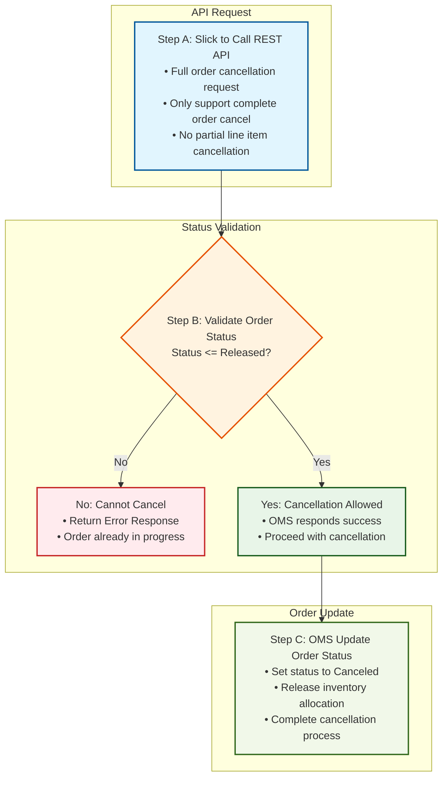

# UC-006: Order Cancellation - System Workflow

## Process Steps

### 1. Slick Cancellation REST API Call
Slick platform initiates cancellation request via REST API
- **API Endpoint:** `DELETE /api/orders/{orderId}/cancel`
- **HTTP Method:** DELETE
- **Request Headers:**
  ```
  Content-Type: application/json
  Authorization: Bearer {slick_api_token}
  X-Request-ID: {unique_request_id}
  ```
- **Request Payload:**
  ```json
  {
    "orderId": "string (required)",
    "cancellationReason": "string (required)",
    "requestedBy": "slick_system",
    "timestamp": "ISO8601"
  }
  ```
- **Full Order Only:** Complete order cancellation - no partial line items
- **Idempotent Operation:** Same request can be safely retried

### 2. OMS Status Validation & Response
OMS validates if order can be canceled based on current status

**Success Response (200 OK) - Status ≤ 3000 (Released):**
```json
{
  "orderId": "string",
  "status": "cancellation_approved",
  "currentOrderStatus": 2000,
  "message": "Order approved for cancellation",
  "timestamp": "ISO8601"
}
```

**Failure Response (409 Conflict) - Status > 3000 (Released):**
```json
{
  "error": {
    "code": "CANCELLATION_NOT_ALLOWED",
    "message": "Order cannot be canceled - already in fulfillment",
    "currentOrderStatus": 3500,
    "allowedStatuses": [1000, 1500, 2000, 3000],
    "timestamp": "ISO8601"
  }
}
```

**Failure Response (404 Not Found) - Order Not Found:**
```json
{
  "error": {
    "code": "ORDER_NOT_FOUND", 
    "message": "Order not found",
    "orderId": "string",
    "timestamp": "ISO8601"
  }
}
```

### 3. OMS Final Cancellation Processing
OMS processes the approved cancellation and updates all systems

**Processing Actions:**
- **Status Update:** Set order status to 9000 (Canceled)
- **Inventory Release:** Release all allocated inventory back to available stock
- **Payment Processing:** Reverse any payment authorizations
- **System Notifications:** Notify customer, fulfillment center, and delivery provider

**Final Success Response (200 OK):**
```json
{
  "orderId": "string",
  "status": "canceled",
  "orderStatus": 9000,
  "cancellationDetails": {
    "canceledAt": "ISO8601",
    "reason": "string",
    "inventoryReleased": true,
    "customerNotified": true
  },
  "message": "Order successfully canceled"
}
```

**Processing Failure Response (500 Internal Server Error):**
```json
{
  "error": {
    "code": "CANCELLATION_PROCESSING_FAILED",
    "message": "Failed to complete cancellation process",
    "details": "Inventory release failed - manual intervention required",
    "orderId": "string",
    "timestamp": "ISO8601"
  }
}
```

## System Workflow Diagram



## Key Cancellation Processing Features

### REST API Integration
- **Slick to OMS API:** Direct REST API call from Slick platform to OMS
- **Simple Request/Response:** Straightforward API integration pattern
- **Real-time Processing:** Immediate validation and response
- **Error Handling:** Clear error responses for invalid cancellation attempts

### Status-Based Validation
- **3000 Released Threshold:** Orders with status <= 3000 can be canceled
- **Automatic Validation:** OMS automatically checks order status eligibility
- **Clear Business Logic:** Simple rule - released or earlier orders only
- **Immediate Response:** Fast validation with success/error response

### Full Order Cancellation Only
- **Complete Order:** No partial line item cancellation supported
- **All-or-Nothing:** Entire order canceled as single unit
- **Inventory Release:** All allocated items returned to available stock
- **Final Status:** Order moved to Canceled

### Simple 3-Step Process
A. **API Call:** Slick calls REST API with order cancellation request
B. **Status Validation:** OMS validates order status <= Released
C. **Order Update:** OMS updates order status to Canceled and releases inventory

## Integration Points
- **Slick Platform:** REST API client for cancellation requests
- **OMS REST API:** Order cancellation endpoint with status validation
- **Inventory System:** Automatic inventory allocation release
- **Status Management:** Order status update to Canceled

## REST API Specifications

### 1. Order Cancellation Request API
- **Trigger:** Customer cancellation request from Slick platform
- **Endpoint:** `DELETE /api/orders/{orderId}/cancel`
- **HTTP Method:** DELETE
- **Request Headers:**
  ```
  Content-Type: application/json
  Authorization: Bearer {slick_api_token}
  X-Request-ID: {unique_request_id}
  ```
- **Request Payload:**
  ```json
  {
    "orderId": "string (required)",
    "cancellationReason": "string (required)",
    "requestedBy": "slick_system",
    "timestamp": "ISO8601"
  }
  ```
- **Idempotent Operation:** Same request can be safely retried
- **Full Order Only:** Complete order cancellation - no partial line items

### 2. Order Status Validation API
- **Trigger:** Cancellation request received
- **Endpoint:** `GET /api/orders/{orderId}/cancellation-eligibility`
- **Success Response (200) - Eligible for Cancellation:**
  ```json
  {
    "orderId": "string",
    "eligible": true,
    "currentOrderStatus": 2000,
    "statusName": "Allocated",
    "message": "Order eligible for cancellation",
    "timestamp": "ISO8601"
  }
  ```
- **Not Eligible Response (409) - Cannot Cancel:**
  ```json
  {
    "orderId": "string",
    "eligible": false,
    "currentOrderStatus": 3500,
    "statusName": "In Process",
    "message": "Order cannot be canceled - already in fulfillment",
    "allowedStatuses": [1000, 1500, 2000, 3000],
    "timestamp": "ISO8601"
  }
  ```

### 3. Order Cancellation Processing API
- **Trigger:** Status validation successful (≤ 3000 Released)
- **Endpoint:** `PUT /api/orders/{orderId}/cancel-process`
- **Request Payload:**
  ```json
  {
    "orderId": "string (required)",
    "cancellationReason": "string (required)",
    "validatedStatus": 2000,
    "processingTimestamp": "ISO8601"
  }
  ```
- **Success Response (200) - Cancellation Approved:**
  ```json
  {
    "orderId": "string",
    "status": "cancellation_approved",
    "currentOrderStatus": 2000,
    "message": "Order approved for cancellation",
    "timestamp": "ISO8601"
  }
  ```

### 4. Final Cancellation Completion API
- **Trigger:** Cancellation approval received
- **Endpoint:** `PUT /api/orders/{orderId}/cancel-complete`
- **Processing Actions:**
  - Status Update: Set order status to 9000 (Canceled)
  - Inventory Release: Release all allocated inventory
  - Payment Processing: Reverse payment authorizations
  - System Notifications: Notify customer, fulfillment, delivery provider
- **Success Response (200) - Cancellation Complete:**
  ```json
  {
    "orderId": "string",
    "status": "canceled",
    "orderStatus": 9000,
    "cancellationDetails": {
      "canceledAt": "ISO8601",
      "reason": "string",
      "inventoryReleased": true,
      "customerNotified": true,
      "paymentReversed": true
    },
    "message": "Order successfully canceled"
  }
  ```
- **Processing Failure Response (500):**
  ```json
  {
    "error": {
      "code": "CANCELLATION_PROCESSING_FAILED",
      "message": "Failed to complete cancellation process",
      "details": "Inventory release failed - manual intervention required",
      "orderId": "string",
      "timestamp": "ISO8601"
    }
  }
  ```

### 5. Inventory Release API
- **Trigger:** Order cancellation processing
- **Endpoint:** `PUT /api/inventory/release/{orderId}`
- **Request Payload:**
  ```json
  {
    "orderId": "string (required)",
    "releaseReason": "order_canceled",
    "items": [
      {
        "itemId": "string",
        "allocatedQuantity": 5,
        "locationId": "string"
      }
    ],
    "timestamp": "ISO8601"
  }
  ```
- **Success Response (200):** Inventory released successfully
- **Failure Response (500):** Manual intervention required for inventory

### 6. Customer Notification API
- **Trigger:** Cancellation completion
- **Endpoint:** `POST /api/notifications/order-canceled`
- **Request Payload:**
  ```json
  {
    "orderId": "string (required)",
    "customerId": "string",
    "cancellationReason": "string",
    "notificationChannels": ["email", "sms"],
    "orderDetails": {
      "orderTotal": 125.50,
      "refundAmount": 125.50,
      "refundMethod": "original_payment"
    }
  }
  ```
- **Success Response (200):** Customer notified successfully
- **Failure Response (500):** Notification failed, manual follow-up required

## REST API Error Handling & Retry Strategy

### HTTP Status Codes & Actions
- **200 OK:** Cancellation successful → Continue normal flow
- **404 Not Found:** Order not found → Alert Slick, log error, notify operations
- **409 Conflict:** Status too advanced → Return error to Slick, customer notification
- **500 Internal Server Error:** Processing failure → Retry with exponential backoff
- **503 Service Unavailable:** OMS overloaded → Retry after delay

### Retry Logic
```json
{
  "maxRetries": 3,
  "backoffStrategy": "exponential",
  "intervals": ["1s", "2s", "4s"],
  "retryableErrors": [500, 502, 503, 504],
  "nonRetryableErrors": [400, 404, 409]
}
```

### Success/Failure Actions
**On Success (200):**
1. Log successful cancellation
2. Update Slick system status
3. Trigger customer notification
4. Release any holds or reservations

**On Retriable Failure (5xx):**
1. Execute retry strategy (3 attempts)
2. Log each retry attempt
3. Escalate to manual intervention after max retries
4. Maintain order in current status

**On Non-Retriable Failure (4xx):**
1. Log error details
2. Return specific error to Slick
3. Alert operations team for invalid requests
4. Stop retry attempts immediately

**On Timeout (30s):**
1. Cancel request
2. Alert operations team
3. Manual investigation required
4. Customer service notification

### Circuit Breaker Pattern
- **Failure Threshold:** 5 consecutive failures
- **Open Circuit Duration:** 60 seconds
- **Half-Open Testing:** Single request to test recovery

## Cancellation Business Rules

### API Integration Rules
A. **REST API Only:** Cancellation must use REST API integration
B. **Slick Platform:** Only Slick can initiate cancellation requests
C. **Full Order Required:** Complete order cancellation only (no partial)
D. **Standard Response:** Success/error response pattern

### Status Validation Rules
A. **Released Threshold:** Orders with status <= Released can be canceled
B. **Automatic Check:** OMS automatically validates order eligibility
C. **No Override:** Status validation cannot be bypassed
D. **Clear Logic:** Released or earlier orders only - no exceptions

### Order Processing Rules
A. **Status Update:** Order status changed to Canceled
B. **Inventory Release:** All allocated inventory returned to available stock
C. **Immediate Effect:** Cancellation processed immediately upon validation
D. **Final Action:** Cancellation is irreversible once processed

### System Response Rules
A. **Success Response:** OMS responds success when cancellation allowed
B. **Error Response:** Clear error when cancellation not permitted
C. **Status Communication:** Current order status communicated in response
D. **Audit Trail:** Complete cancellation event logging maintained

---

*This workflow covers the complete UC-006: Order Cancellation system flow for QC Small Format convenience store operations with full order cancellation, API integration, and Slick notification system with Manhattan Active Omni integration.*