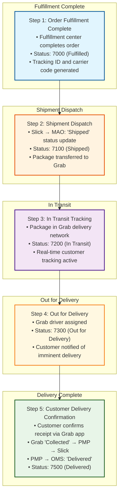

# UC-007: Delivery Tracking - Complete System Workflow

## Process Steps

### 1. Order Fulfillment Complete
Order completed by fulfillment center and status updated to Fulfilled
- **Slick Fulfillment:** Fulfillment center completes order processing
- **Status Update:** Order status updated to 7000 (Fulfilled)
- **Tracking Generation:** Unique tracking ID and carrier code generated
- **System Notification:** OMS receives fulfillment confirmation

### 2. Shipment Dispatch
Order leaves fulfillment center and enters shipping network
- **Slick → MAO:** "Shipped" status update sent to Manhattan Active Omni
- **Status Update:** Order status updated to 7100 (Shipped)
- **Carrier Handoff:** Package transferred to delivery provider (Grab)
- **Tracking Activation:** Customer tracking information becomes active

### 3. In Transit Tracking
Package with delivery provider moving toward customer location
- **Logistics Update:** Package in Grab delivery network
- **Status Update:** Order status updated to 7200 (In Transit)
- **Real-Time Tracking:** Customer can track package location
- **ETA Calculation:** Estimated delivery time provided to customer

### 4. Out for Delivery
Package assigned to delivery driver for final delivery
- **Driver Assignment:** Grab driver assigned to delivery
- **Status Update:** Order status updated to 7300 (Out for Delivery)
- **Customer Notification:** Customer notified of imminent delivery
- **Final Mile:** Package in final delivery stage

### 5. Customer Delivery Confirmation
Customer receives package and confirms delivery
- **Customer Confirmation:** Customer confirms receipt through Grab app
- **Grab "Collected" Status:** Grab marks order as "Collected" by customer
- **PMP → Slick:** "Collected" status update sent to Slick platform
- **PMP → OMS:** "Delivered" status update sent to OMS
- **Status Update:** Final order status updated to 7500 (Delivered)

## System Workflow Diagram



## Complete Delivery Status Hierarchy

### Status Progression Flow
| Step | Status Code | Status Name | Description | System Trigger |
|------|-------------|-------------|-------------|----------------|
| **1** | **7000** | **Fulfilled** | Order completed by fulfillment center | Fulfillment center complete |
| **2** | **7100** | **Shipped** | Departed seller location | Slick → MAO update |
| **3** | **7200** | **In Transit** | With logistics provider | Grab network update |
| **4** | **7300** | **Out for Delivery** | Final delivery stage | Grab driver assignment |
| **5** | **7500** | **Delivered** | Customer delivery confirmed | Customer Grab confirmation |

## Three-Tier Grab Integration Flow

### Integration Architecture
```
[Fulfillment Center] → [Slick Platform] → [MAO System]
                           ↓
[Grab Delivery Network] → [PMP Platform] → [OMS Updates]
                           ↓
                  [Customer Confirmation]
```

### Three-Tier Status Flow Detail
1. **Tier 1: PMP → OMS** - "Delivered" status update (final confirmation)
2. **Tier 2: Slick → MAO** - "Shipped" status update (dispatch notification)  
3. **Tier 3: PMP → Slick** - "Collected" status update (customer confirmation relay)

## Key Delivery Tracking Features

### Complete 5-Step Process
A. **Fulfillment Complete:** Fulfillment center completion with tracking generation
B. **Shipment Dispatch:** Slick-to-MAO shipped notification  
C. **In Transit Tracking:** Grab network real-time tracking
D. **Out for Delivery:** Final mile driver assignment
E. **Delivery Confirmation:** Customer-confirmed completion

### Advanced Status Management
- **Comprehensive Hierarchy:** 5 distinct delivery status codes (7000→7100→7200→7300→7500)
- **Real-Time Updates:** Immediate status progression across all systems
- **Tracking Validation:** Order ID, tracking ID, and carrier code verification
- **Event-Driven Processing:** Each status triggered by specific system events

### Multi-System Integration
- **Fulfillment Center:** Order completion and tracking generation
- **Slick Platform:** Shipment dispatch and status coordination
- **MAO System:** Status management and order tracking
- **Grab Delivery Network:** In-transit tracking and driver coordination
- **PMP Platform:** Partner management and delivery confirmation
- **Customer Interface:** Grab app for tracking and delivery confirmation

### Customer Experience Enhancement
- **Proactive Notifications:** Status updates at each delivery stage
- **Real-Time Tracking:** Live package location during transit
- **Delivery Coordination:** Direct communication with Grab driver
- **Confirmation Control:** Customer-initiated delivery completion

## REST API Specifications

### 1. Fulfillment Complete API
- **Trigger:** Fulfillment center completes order processing
- **Endpoint:** `PUT /api/orders/{orderId}/fulfillment-complete`
- **Request Headers:**
  ```
  Content-Type: application/json
  Authorization: Bearer {fulfillment_api_token}
  X-Request-ID: {unique_request_id}
  ```
- **Request Payload:**
  ```json
  {
    "orderId": "string (required)",
    "fulfillmentStatus": "completed",
    "trackingInfo": {
      "trackingId": "string (required)",
      "carrierId": "GRAB",
      "carrierCode": "string"
    },
    "completedAt": "ISO8601",
    "fulfillmentCenter": "string"
  }
  ```
- **Success Response (200):**
  ```json
  {
    "orderId": "string",
    "status": "fulfilled",
    "orderStatus": 7000,
    "trackingInfo": {
      "trackingId": "string",
      "carrierId": "GRAB",
      "trackingUrl": "string"
    },
    "message": "Order fulfillment completed successfully"
  }
  ```

### 2. Shipment Dispatch API
- **Trigger:** Package leaves fulfillment center
- **Endpoint:** `PUT /api/delivery/status/shipped`
- **Request Payload:**
  ```json
  {
    "orderId": "string (required)",
    "trackingId": "string (required)",
    "carrierCode": "GRAB",
    "shipmentStatus": "shipped",
    "departureTime": "ISO8601",
    "fromLocation": {
      "locationId": "string",
      "address": "string"
    }
  }
  ```
- **Success Response (200):**
  ```json
  {
    "orderId": "string",
    "status": "shipped",
    "orderStatus": 7100,
    "estimatedDelivery": "ISO8601",
    "customerNotified": true,
    "message": "Shipment dispatched successfully"
  }
  ```

### 3. In Transit Tracking API
- **Trigger:** Package in Grab delivery network
- **Endpoint:** `PUT /api/delivery/status/in-transit`
- **Request Payload:**
  ```json
  {
    "orderId": "string (required)",
    "trackingId": "string (required)",
    "transitStatus": "in_transit",
    "currentLocation": {
      "latitude": "string",
      "longitude": "string",
      "address": "string"
    },
    "estimatedDeliveryTime": "ISO8601",
    "timestamp": "ISO8601"
  }
  ```
- **Success Response (200):**
  ```json
  {
    "orderId": "string",
    "status": "in_transit", 
    "orderStatus": 7200,
    "trackingDetails": {
      "currentLocation": "string",
      "estimatedDelivery": "ISO8601",
      "distanceToDestination": "5.2 km"
    },
    "customerNotified": true
  }
  ```

### 4. Out for Delivery API
- **Trigger:** Package assigned to delivery driver
- **Endpoint:** `PUT /api/delivery/status/out-for-delivery`
- **Request Payload:**
  ```json
  {
    "orderId": "string (required)",
    "trackingId": "string (required)",
    "deliveryStatus": "out_for_delivery",
    "driverInfo": {
      "driverId": "string",
      "driverName": "string",
      "driverPhone": "string",
      "vehicleInfo": "string"
    },
    "estimatedArrival": "ISO8601",
    "timestamp": "ISO8601"
  }
  ```
- **Success Response (200):**
  ```json
  {
    "orderId": "string",
    "status": "out_for_delivery",
    "orderStatus": 7300,
    "driverDetails": {
      "driverName": "string",
      "driverPhone": "string",
      "estimatedArrival": "ISO8601"
    },
    "customerNotified": true,
    "message": "Package out for delivery"
  }
  ```

### 5. Customer Delivery Confirmation API
- **Trigger:** Customer confirms receipt via Grab app
- **Endpoint:** `PUT /api/delivery/status/delivered`
- **Request Payload:**
  ```json
  {
    "orderId": "string (required)",
    "trackingId": "string (required)",
    "deliveryStatus": "delivered",
    "customerConfirmation": {
      "customerId": "string",
      "confirmationMethod": "grab_app",
      "deliveredTo": "customer",
      "deliveryPhoto": "string (optional)",
      "customerSignature": "string (optional)"
    },
    "deliveredAt": "ISO8601",
    "driverId": "string"
  }
  ```
- **Success Response (200):**
  ```json
  {
    "orderId": "string",
    "status": "delivered",
    "orderStatus": 7500,
    "deliveryConfirmation": {
      "deliveredAt": "ISO8601",
      "confirmationReceived": true,
      "deliveryComplete": true
    },
    "message": "Order delivered successfully"
  }
  ```

### 6. Grab Status Integration APIs

#### PMP to OMS Delivered Update
- **Trigger:** Customer confirms delivery in Grab app
- **Endpoint:** `PUT /api/pmp/delivery-status/delivered`
- **Request Payload:**
  ```json
  {
    "orderId": "string (required)",
    "grabOrderId": "string",
    "deliveryStatus": "delivered",
    "customerConfirmed": true,
    "deliveredAt": "ISO8601"
  }
  ```

#### Slick to MAO Shipped Update  
- **Trigger:** Package dispatch from fulfillment center
- **Endpoint:** `PUT /api/slick/shipment-status/shipped`
- **Request Payload:**
  ```json
  {
    "orderId": "string (required)",
    "shipmentStatus": "shipped",
    "trackingId": "string",
    "shippedAt": "ISO8601"
  }
  ```

#### PMP to Slick Collected Update
- **Trigger:** Grab driver completes delivery
- **Endpoint:** `PUT /api/pmp/slick/status/collected`
- **Request Payload:**
  ```json
  {
    "orderId": "string (required)",
    "collectionStatus": "collected",
    "collectedBy": "customer",
    "collectedAt": "ISO8601"
  }
  ```

### 7. Real-Time Tracking Query API
- **Trigger:** Customer tracking request
- **Endpoint:** `GET /api/delivery/tracking/{orderId}`
- **Query Parameters:**
  ```
  orderId: string (required)
  trackingId: string (optional)
  includeHistory: boolean (default: false)
  ```
- **Success Response (200):**
  ```json
  {
    "orderId": "string",
    "trackingId": "string",
    "currentStatus": "in_transit",
    "orderStatus": 7200,
    "statusHistory": [
      {
        "status": "fulfilled",
        "timestamp": "ISO8601",
        "location": "Fulfillment Center"
      },
      {
        "status": "shipped", 
        "timestamp": "ISO8601",
        "location": "Departure Hub"
      }
    ],
    "estimatedDelivery": "ISO8601",
    "driverInfo": {
      "driverName": "string",
      "driverPhone": "string"
    }
  }
  ```

## API Error Handling & Retry Strategy

### HTTP Status Codes & Actions
- **200 OK:** Status update successful → Continue tracking flow
- **404 Not Found:** Order/tracking not found → Alert customer service
- **409 Conflict:** Invalid status transition → Log error, maintain current status
- **500 Internal Server Error:** System failure → Retry with exponential backoff
- **503 Service Unavailable:** Service overloaded → Retry after delay

### Retry Logic
```json
{
  "maxRetries": 3,
  "backoffStrategy": "exponential",
  "intervals": ["2s", "4s", "8s"],
  "retryableErrors": [500, 502, 503, 504],
  "nonRetryableErrors": [400, 404, 409]
}
```

### Success/Failure Actions
**On Success (200):**
1. Update order status to next stage
2. Trigger customer notification
3. Log tracking event with timestamp
4. Update real-time tracking information

**On Retriable Failure (5xx):**
1. Execute retry strategy (3 attempts)
2. Log retry attempts with details
3. Escalate to manual intervention after max retries
4. Maintain current delivery status

**On Non-Retriable Failure (4xx):**
1. Log error with full context
2. Alert operations team for investigation
3. Notify customer service for manual handling
4. Stop automated status progression

**On Timeout (30s):**
1. Cancel current status update request
2. Alert operations and customer service teams
3. Manual investigation and status correction required
4. Customer communication for delivery delays

### Circuit Breaker Pattern
- **Failure Threshold:** 5 consecutive API failures
- **Open Circuit Duration:** 180 seconds
- **Half-Open Testing:** Single test request to verify system recovery
- **Fallback Action:** Manual delivery tracking and customer notification

## Integration Points

### Primary Systems
- **Fulfillment Centers:** Order completion and tracking initialization
- **Slick Integration Platform:** Dispatch coordination and status updates
- **Manhattan Active Omni:** Central order status management
- **Grab Delivery Network:** Last-mile delivery and customer interaction
- **PMP (Partner Management Platform):** Multi-partner coordination

### Data Flow Architecture
- **Fulfillment → Tracking:** Fulfillment center generates tracking data for Slick platform
- **Dispatch → Shipping:** Slick notifies MAO of shipment departure
- **Transit → Delivery:** Grab provides real-time location and delivery updates
- **Confirmation → Completion:** Customer confirmation flows through PMP to OMS

## Delivery Tracking Business Rules

### Status Progression Rules
1. **Sequential Status Flow:** Must progress 7000→7100→7200→7300→7500 (no skipping)
2. **Event-Driven Triggers:** Each status change triggered by specific system event
3. **Validation Requirements:** Order ID, tracking ID, and carrier code must be verified
4. **Real-Time Processing:** Status updates must be processed immediately upon receipt

### System Integration Rules
1. **Fulfillment Requirement:** Order must be marked as Fulfilled (7000) before shipping
2. **Slick Dispatch Notification:** Shipped status (7100) requires Slick → MAO notification
3. **Grab Network Integration:** In Transit (7200) and Out for Delivery (7300) managed by Grab
4. **Customer Confirmation Requirement:** Delivered (7500) requires customer confirmation via Grab app

### Tracking Validation Rules
1. **Unique Tracking ID:** Each order must have unique tracking identifier
2. **Carrier Code Verification:** Grab carrier code must be validated
3. **Order ID Consistency:** Order ID must remain consistent across all status updates
4. **Timestamp Accuracy:** Each status change must include accurate timestamp

### Customer Interaction Rules
1. **Proactive Notifications:** Customer must receive notification at each status change
2. **Tracking Access:** Customer must have access to real-time tracking information
3. **Delivery Confirmation:** Customer must confirm receipt through Grab mobile app
4. **Status Visibility:** Customer must see clear status progression throughout delivery

### Error Handling Rules
1. **Failed Delivery Retry:** System must support delivery retry mechanisms
2. **Lost Package Tracking:** Procedures for handling lost or delayed packages
3. **Customer Unavailable:** Process for handling customer unavailability
4. **System Integration Failures:** Fallback procedures for integration system failures

## Business Impact

### Operational Efficiency
- **Automated Tracking:** Reduces manual tracking and customer service inquiries
- **Real-Time Visibility:** Enables proactive customer service and issue resolution
- **Multi-System Coordination:** Streamlines operations across Fulfillment Centers, Slick, MAO, Grab, and PMP
- **Customer Self-Service:** Reduces dependency on customer service for delivery updates

### Customer Satisfaction
- **Transparency:** Complete visibility into delivery progress
- **Proactive Communication:** Automatic notifications at each delivery stage
- **Control:** Customer-initiated delivery confirmation
- **Reliability:** Comprehensive tracking with multiple validation points

---

*This workflow covers the complete UC-007: Delivery Tracking system flow for QC Small Format convenience store operations with comprehensive 5-step delivery progression, three-tier Grab integration, real-time tracking validation, and Manhattan Active Omni coordination.*