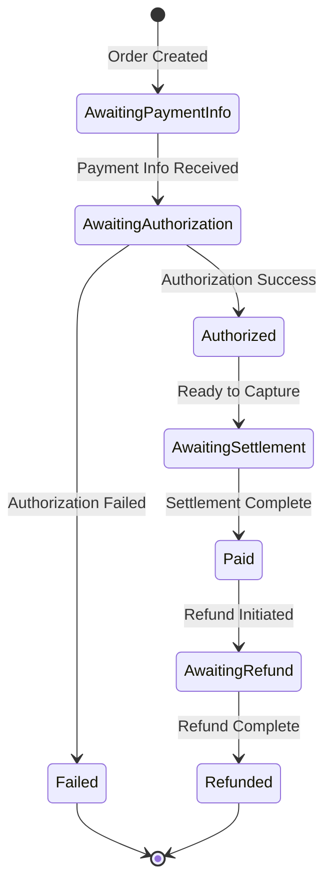

# Payment Processing Workflow Requirements - MVP Phase

## 1. Payment Lifecycle Management

### 1.1 Payment Status Flow
- **Requirement ID**: PAY-WF-001
- **Status Progression**:


### 1.2 Payment Status Codes
- **Requirement ID**: PAY-WF-002

| Status ID | Status Name | Description | Next Valid States |
|-----------|-------------|-------------|-------------------|
| 0 | Not Applicable | No payment required | - |
| 1000 | Awaiting Payment Info | Payment details pending | 2000, 9000 |
| 2000 | Awaiting Authorization | Authorization pending | 3000, 9000 |
| 3000 | Authorized | Payment authorized | 4000, 6000, 9000 |
| 4000 | Awaiting Settlement | Settlement pending | 5000, 6000, 9000 |
| 5000 | Paid | Payment completed | 6000 |
| 6000 | Awaiting Refund | Refund processing | 7000 |
| 7000 | Refunded | Refund completed | - |
| 9000 | Failed | Payment failed | 1000 |

## 2. Payment Method Configuration

### 2.1 Supported Payment Methods
- **Requirement ID**: PAY-WF-003
- **MVP Payment Types**:

| Method Code | Method Name | Gateway | Authorization Required | Settlement Type |
|-------------|-------------|---------|------------------------|-----------------|
| CC | Credit Card | Adyen | Yes | Delayed |
| DC | Debit Card | Adyen | Yes | Immediate |
| PP | PayPal | PayPal | Yes | Immediate |
| COD | Cash on Delivery | Internal | No | On Delivery |
| BT | Bank Transfer | Internal | No | Pre-payment |

### 2.2 Payment Method Rules
- **Requirement ID**: PAY-WF-004
- **Business Rules**:
  ```
  IF payment_method == "COD" THEN
    max_order_value = 5000.00
    delivery_zones = ["BKK", "METRO"]
  
  IF payment_method == "CC" THEN
    require_3ds = true
    min_amount = 1.00
    max_amount = 100000.00
  ```

## 3. Payment Authorization

### 3.1 Authorization Request
- **Requirement ID**: PAY-AUTH-001
- **Request Structure**:
```json
{
  "orderId": "QC-2024-01-10-000001",
  "paymentMethod": "CC",
  "amount": 1299.99,
  "currency": "THB",
  "cardDetails": {
    "encryptedCardNumber": "encrypted_string",
    "expiryMonth": "12",
    "expiryYear": "2025",
    "cvv": "encrypted_cvv"
  },
  "customerInfo": {
    "customerId": "CUST-123456",
    "email": "customer@example.com",
    "ipAddress": "192.168.1.1"
  },
  "3dsRequired": true
}
```

### 3.2 Authorization Response
- **Requirement ID**: PAY-AUTH-002
- **Response Structure**:
```json
{
  "authorizationId": "AUTH-123456789",
  "status": "APPROVED",
  "authCode": "ABC123",
  "amount": 1299.99,
  "timestamp": "2024-01-10T10:00:00Z",
  "expiryTime": "2024-01-17T10:00:00Z",
  "gatewayResponse": {
    "code": "00",
    "message": "Approved"
  }
}
```

### 3.3 Authorization Rules
- **Requirement ID**: PAY-AUTH-003
- **Business Logic**:
  - Authorization valid for 7 days
  - Auto-capture after order fulfillment
  - Void authorization if order canceled
  - Re-authorization required if expired

## 4. Payment Settlement

### 4.1 Settlement Trigger
- **Requirement ID**: PAY-SET-001
- **Trigger Conditions**:
  ```
  IF order.status == "Fulfilled" AND payment.status == "Authorized" THEN
    INITIATE settlement_capture
  
  IF order.status == "Shipped" AND payment.method == "COD" THEN
    WAIT for delivery_confirmation
  ```

### 4.2 Settlement Request
- **Requirement ID**: PAY-SET-002
- **Capture Request**:
```json
{
  "authorizationId": "AUTH-123456789",
  "captureAmount": 1299.99,
  "finalCapture": true,
  "reference": "QC-2024-01-10-000001"
}
```

### 4.3 Partial Settlement
- **Requirement ID**: PAY-SET-003
- **Rules for Partial Capture**:
  - Allowed for order modifications
  - Maximum 3 partial captures
  - Sum of captures <= authorized amount
  - Final capture flag required

## 5. Payment Validation Rules

### 5.1 Amount Validation
- **Requirement ID**: PAY-VAL-001
- **Validation Logic**:
```javascript
function validatePaymentAmount(order, payment) {
  const orderTotal = calculateOrderTotal(order);
  const paymentTotal = payment.amount;
  
  if (Math.abs(orderTotal - paymentTotal) > 0.01) {
    throw new Error("Payment amount mismatch");
  }
  
  if (payment.amount < 1.00) {
    throw new Error("Payment amount below minimum");
  }
  
  return true;
}
```

### 5.2 Substitution Payment Rules
- **Requirement ID**: PAY-VAL-002
- **20% Increment Limit**:
```javascript
function validateSubstitutionAmount(original, substitution) {
  const maxAllowed = original * 1.20;
  
  if (substitution > maxAllowed) {
    return {
      valid: false,
      maxAllowed: maxAllowed,
      difference: substitution - maxAllowed
    };
  }
  
  return { valid: true };
}
```

## 6. Refund Processing

### 6.1 Refund Triggers
- **Requirement ID**: PAY-REF-001
- **Automatic Refund Conditions**:
  - Order cancellation after payment
  - Return approval
  - Failed fulfillment after payment
  - Duplicate payment

### 6.2 Refund Calculation
- **Requirement ID**: PAY-REF-002
- **Refund Amount Logic**:
```javascript
function calculateRefund(order, returnItems) {
  let refundAmount = 0;
  
  // Full refund for cancellation
  if (order.status === "Canceled") {
    refundAmount = order.paidAmount;
  }
  
  // Partial refund for returns
  else if (returnItems.length > 0) {
    returnItems.forEach(item => {
      refundAmount += (item.unitPrice * item.quantity);
      refundAmount -= item.usedPromotions;
    });
  }
  
  // Include shipping refund if applicable
  if (order.shippingRefundEligible) {
    refundAmount += order.shippingFee;
  }
  
  return Math.min(refundAmount, order.paidAmount);
}
```

### 6.3 Refund Request
- **Requirement ID**: PAY-REF-003
- **Request Structure**:
```json
{
  "orderId": "QC-2024-01-10-000001",
  "paymentId": "PAY-123456",
  "refundAmount": 500.00,
  "refundReason": "CUSTOMER_RETURN",
  "refundItems": [
    {
      "sku": "SKU-001",
      "quantity": 1,
      "amount": 500.00
    }
  ]
}
```

## 7. Payment Gateway Integration

### 7.1 Adyen Integration
- **Requirement ID**: PAY-GW-001
- **Configuration**:
```yaml
adyen:
  merchantAccount: "QC_SMF_TH"
  apiKey: "${ADYEN_API_KEY}"
  environment: "live"
  endpoints:
    authorization: "https://live.adyen.com/payment/v68/authorise"
    capture: "https://live.adyen.com/payment/v68/capture"
    refund: "https://live.adyen.com/payment/v68/refund"
  timeout: 30000
  retries: 3
```

### 7.2 Gateway Error Handling
- **Requirement ID**: PAY-GW-002
- **Error Mapping**:

| Gateway Code | Internal Code | Action |
|--------------|--------------|--------|
| 00 | SUCCESS | Continue |
| 05 | DECLINED | Retry with different payment |
| 14 | INVALID_CARD | Request new payment method |
| 51 | INSUFFICIENT_FUNDS | Retry or alternative payment |
| 91 | GATEWAY_TIMEOUT | Retry with backoff |

## 8. Payment Security

### 8.1 PCI Compliance
- **Requirement ID**: PAY-SEC-001
- **Requirements**:
  - No card data storage
  - Use tokenization for recurring payments
  - TLS 1.2+ for all communications
  - Card data encryption in transit

### 8.2 Fraud Prevention
- **Requirement ID**: PAY-SEC-002
- **Fraud Checks**:
```javascript
const fraudRules = {
  velocityCheck: {
    maxTransactionsPerHour: 5,
    maxAmountPerDay: 50000
  },
  blacklistCheck: {
    checkEmail: true,
    checkIP: true,
    checkCard: true
  },
  riskScore: {
    threshold: 70,
    factors: ['amount', 'history', 'location']
  }
};
```

## 9. Payment Events

### 9.1 Payment Event Types
- **Requirement ID**: PAY-EVT-001
- **Event Definitions**:

| Event Type | Trigger | Payload |
|------------|---------|---------|
| payment.authorized | Authorization success | authId, amount, orderId |
| payment.captured | Settlement complete | captureId, amount, orderId |
| payment.failed | Payment failure | reason, orderId, attemptCount |
| payment.refunded | Refund complete | refundId, amount, orderId |
| payment.voided | Authorization void | authId, orderId, reason |

### 9.2 Event Publishing
- **Requirement ID**: PAY-EVT-002
- **Kafka Configuration**:
```json
{
  "topic": "payment-events",
  "message": {
    "eventType": "payment.authorized",
    "timestamp": "2024-01-10T10:00:00Z",
    "orderId": "QC-2024-01-10-000001",
    "payload": {
      "authorizationId": "AUTH-123456",
      "amount": 1299.99,
      "currency": "THB"
    }
  }
}
```

## 10. Payment Reconciliation

### 10.1 Daily Reconciliation
- **Requirement ID**: PAY-REC-001
- **Process**:
  1. Extract daily transactions
  2. Match with gateway reports
  3. Identify discrepancies
  4. Generate reconciliation report

### 10.2 Reconciliation Report
- **Requirement ID**: PAY-REC-002
- **Report Fields**:
  - Transaction count
  - Total authorized amount
  - Total captured amount
  - Refunded amount
  - Failed transactions
  - Pending settlements
  - Discrepancies

## 11. Performance Requirements

### 11.1 Response Times
- **Requirement ID**: PAY-PERF-001
- **SLA Requirements**:
  - Authorization: < 3 seconds
  - Capture: < 2 seconds
  - Refund: < 5 seconds
  - Status check: < 500ms

### 11.2 Throughput
- **Requirement ID**: PAY-PERF-002
- **Capacity**:
  - 100 transactions per second
  - 99.9% availability
  - Automatic scaling at 70% capacity

## 12. Testing Requirements

### 12.1 Payment Test Cases
- **Requirement ID**: PAY-TEST-001
- **Test Scenarios**:
  - Successful authorization and capture
  - Declined authorization
  - Partial capture
  - Full refund
  - Partial refund
  - Timeout handling
  - Duplicate payment prevention
  - Fraud detection trigger

### 12.2 Test Card Numbers
- **Requirement ID**: PAY-TEST-002
- **Test Cards**:
  - Success: 4111111111111111
  - Decline: 4000000000000002
  - 3DS Required: 4000000000001000
  - Insufficient Funds: 4000000000009995