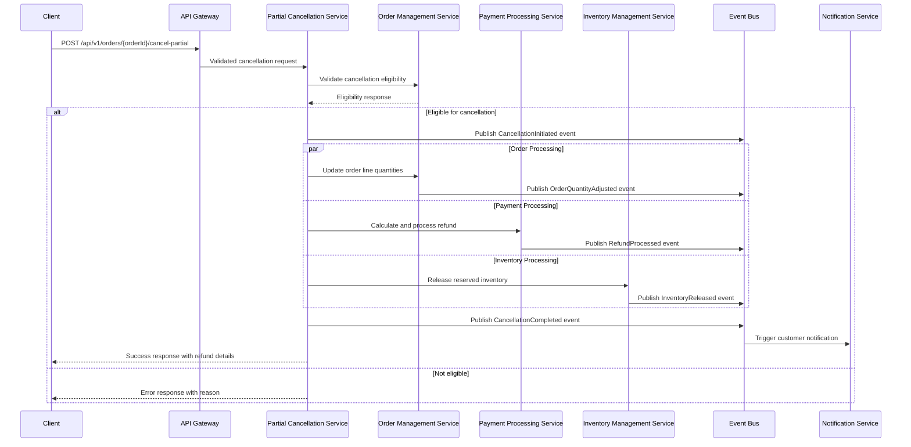

# Partial Quantity Cancellation System Architecture - Manhattan Active Omni

## Executive Summary

This document presents a comprehensive system architecture for implementing partial quantity cancellation capabilities in Manhattan Active Omni (MAO). The architecture builds on the existing data models and system requirements to provide enterprise-grade, scalable partial cancellation functionality that integrates seamlessly with Manhattan's ecosystem.

## 1. System Architecture Overview

### High-Level Architecture Components

```yaml
architecture_overview:
  architectural_style: "Event-driven microservices with domain-driven design"
  deployment_model: "Cloud-native with multi-region support"
  integration_pattern: "API-first with event-driven communication"
  data_strategy: "Domain-specific databases with event sourcing for critical workflows"
  
core_services:
  - Order Management Service
  - Partial Cancellation Service
  - Payment Processing Service
  - Inventory Management Service
  - Notification Service
  - Audit Service
```

### System Context Diagram

```
┌─────────────────────────────────────────────────────────────────────┐
│                          External Systems                          │
├─────────────────────────────────────────────────────────────────────┤
│  E-commerce    │    Mobile    │   Store POS   │   Payment    │  WMS │
│  Platforms     │     Apps     │   Systems     │  Gateways    │      │
└─────────────┬───────────┬─────────────┬─────────────┬────────────────┘
              │           │             │             │
              v           v             v             v
┌─────────────────────────────────────────────────────────────────────┐
│                      API Gateway Layer                             │
│  • Rate Limiting    • Authentication    • Request Routing          │
└─────────────────────────┬───────────────────────────────────────────┘
                          │
              ┌───────────v──────────┐
              │  Partial Cancellation │
              │    Orchestration      │
              │      Service          │
              └─────────┬─────────────┘
                        │
        ┌───────────────┼───────────────┐
        │               │               │
        v               v               v
┌─────────────┐ ┌──────────────┐ ┌─────────────┐
│   Order     │ │   Payment    │ │  Inventory  │
│ Management  │ │  Processing  │ │ Management  │
│   Service   │ │   Service    │ │   Service   │
└─────────────┘ └──────────────┘ └─────────────┘
        │               │               │
        └───────────────┼───────────────┘
                        │
        ┌───────────────v───────────────┐
        │       Event Stream Bus        │
        │        (Apache Kafka)         │
        └───────────────────────────────┘
                        │
        ┌───────────────v───────────────┐
        │    Notification & Audit       │
        │         Services              │
        └───────────────────────────────┘
```

### Core Domain Boundaries

**Partial Cancellation Domain**:
- Cancellation request processing
- Business rule validation
- Cancellation orchestration
- Refund calculation

**Order Management Domain**:
- Order state management
- Line item quantity tracking
- Order lifecycle control
- Status propagation

**Payment Domain**:
- Refund processing
- Payment authorization reversal
- Financial transaction management
- PCI compliance

**Inventory Domain**:
- Inventory reservation release
- Availability recalculation
- Allocation adjustment
- Stock level updates

## 2. Processing Flow Architecture

### 2.1 Partial Cancellation Request Flow

```yaml
cancellation_flow:
  1_request_validation:
    - Authentication & authorization
    - Request payload validation
    - Business rule checks
    - Cancellation eligibility
    
  2_orchestration:
    - Async orchestration initiation
    - Compensating transaction setup
    - Event correlation ID generation
    - Process state tracking
    
  3_domain_processing:
    - Order quantity adjustment
    - Payment refund calculation
    - Inventory reservation release
    - Status update propagation
    
  4_completion:
    - Customer notification
    - System event publishing
    - Audit trail creation
    - Response generation
```

### 2.2 Detailed Processing Sequence



### 2.3 Error Handling & Compensation Patterns

**Circuit Breaker Pattern**: Prevent cascade failures across services
- Payment service failures don't block inventory updates
- Configurable failure thresholds and recovery windows

**Saga Pattern**: Distributed transaction management
- Compensating transactions for partial failures
- Event-driven state management for long-running processes

**Retry Mechanisms**: Resilient service communication
- Exponential backoff for transient failures
- Dead letter queues for permanent failures

```yaml
error_handling:
  compensation_patterns:
    order_update_failed:
      - Reverse payment refund
      - Restore inventory reservation
      - Notify customer of failure
      
    payment_refund_failed:
      - Retry refund processing
      - Create manual refund task
      - Maintain order quantity adjustment
      
    inventory_release_failed:
      - Queue for retry processing
      - Alert inventory management team
      - Continue with cancellation completion
```

## 3. Integration Architecture

### 3.1 API Design Specifications

**RESTful API Endpoints**:

```yaml
partial_cancellation_api:
  base_url: "/api/v1/orders"
  
  endpoints:
    cancel_partial:
      method: POST
      path: "/{orderId}/cancel-partial"
      request_body:
        orderLineIds: ["string"]
        quantities: [integer]
        reason: "string"
        refundMethod: "original|store_credit|manual"
      response:
        cancellationId: "uuid"
        refundAmount: number
        refundMethod: "string"
        status: "processing|completed|failed"
        
    get_cancellation_status:
      method: GET
      path: "/{orderId}/cancellations/{cancellationId}"
      response:
        status: "processing|completed|failed"
        refundDetails: object
        timeline: array
        
    list_cancellations:
      method: GET
      path: "/{orderId}/cancellations"
      query_params:
        status: "string"
        dateFrom: "date"
        dateTo: "date"
```

**GraphQL Schema** (for flexible client queries):

```graphql
type PartialCancellation {
  id: ID!
  orderId: String!
  status: CancellationStatus!
  items: [CancellationItem!]!
  refundAmount: Float!
  refundMethod: RefundMethod!
  reason: String
  createdAt: DateTime!
  completedAt: DateTime
}

type CancellationItem {
  orderLineId: String!
  cancelledQuantity: Int!
  refundAmount: Float!
  item: Item!
}

enum CancellationStatus {
  PROCESSING
  COMPLETED
  FAILED
  CANCELLED
}

type Mutation {
  cancelPartialQuantity(
    orderId: String!
    items: [CancellationItemInput!]!
    reason: String
    refundMethod: RefundMethod
  ): PartialCancellation!
}
```

### 3.2 Event-Driven Architecture

**Event Schema Design**:

```yaml
events:
  CancellationRequested:
    eventId: uuid
    correlationId: uuid
    orderId: string
    customerId: string
    items:
      - orderLineId: string
        cancelQuantity: integer
        unitPrice: number
    requestedBy: string
    reason: string
    timestamp: datetime
    
  CancellationCompleted:
    eventId: uuid
    correlationId: uuid
    orderId: string
    cancellationId: uuid
    refundAmount: number
    refundMethod: string
    completedAt: datetime
    
  CancellationFailed:
    eventId: uuid
    correlationId: uuid
    orderId: string
    failureReason: string
    compensationRequired: boolean
```

**Kafka Topic Design**:

```yaml
kafka_topics:
  order-events:
    partitions: 12
    replication: 3
    retention: 7_days
    compaction: false
    
  payment-events:
    partitions: 6
    replication: 3
    retention: 30_days
    compaction: false
    
  inventory-events:
    partitions: 24
    replication: 3
    retention: 7_days
    compaction: false
    
  cancellation-events:
    partitions: 12
    replication: 3
    retention: 30_days
    compaction: false
```

### 3.3 External System Integration

**Manhattan Active Warehouse Management (MAWM)**:
```yaml
mawm_integration:
  api_endpoints:
    - POST /wm/inventory/unreserve
    - GET /wm/inventory/status
  message_queues:
    - wm.inventory.adjustments
    - wm.fulfillment.updates
  sync_patterns:
    - Real-time for critical operations
    - Batch reconciliation nightly
```

**Payment Gateway Integration**:
```yaml
payment_gateways:
  stripe:
    refund_api: "POST /v1/refunds"
    webhook_endpoint: "/webhooks/stripe/refunds"
    retry_policy: exponential_backoff
    
  paypal:
    refund_api: "POST /v2/payments/refunds"
    webhook_endpoint: "/webhooks/paypal/refunds"
    
  adyen:
    refund_api: "POST /refund"
    notification_endpoint: "/webhooks/adyen/notifications"
```

**E-commerce Platform Integration**:
```yaml
ecommerce_integration:
  shopify:
    webhook_subscriptions:
      - orders/cancelled
      - orders/partially_fulfilled
    api_updates:
      - order_status_sync
      - inventory_adjustment
      
  magento:
    event_observers:
      - sales_order_item_cancel_after
    api_endpoints:
      - creditmemo/create
      - inventory/stock/update
```

## 4. Scalability & Performance Architecture

### 4.1 Horizontal Scaling Strategies

**Microservice Scaling**:
```yaml
service_scaling:
  partial_cancellation_service:
    min_instances: 3
    max_instances: 50
    cpu_threshold: 70%
    memory_threshold: 80%
    custom_metrics:
      - cancellation_queue_depth
      - processing_time_p99
      
  order_management_service:
    min_instances: 5
    max_instances: 100
    scaling_triggers:
      - order_volume_spike
      - cancellation_rate_increase
      
  payment_processing_service:
    min_instances: 2
    max_instances: 20
    pci_compliance: required
    dedicated_instances: true
```

**Database Scaling**:
```yaml
database_scaling:
  read_replicas:
    count: 5
    distribution: multi_region
    lag_tolerance: 500ms
    
  connection_pooling:
    max_connections_per_service: 50
    connection_timeout: 30s
    idle_timeout: 10m
    
  query_optimization:
    prepared_statements: enabled
    query_cache: enabled
    index_optimization: automated
```

### 4.2 Caching Architecture

**Multi-Level Caching Strategy**:

```yaml
caching_layers:
  l1_application_cache:
    technology: Caffeine (in-memory)
    ttl: 5_minutes
    max_size: 10000_entries
    use_cases:
      - Order status lookups
      - Customer profile caching
      - Business rule caching
      
  l2_distributed_cache:
    technology: Redis Cluster
    ttl: 30_minutes
    max_memory: 16GB_per_node
    nodes: 6 (3 master, 3 replica)
    use_cases:
      - Session management
      - Payment tokenization
      - Inventory availability
      
  l3_cdn_cache:
    technology: CloudFront
    ttl: 24_hours
    use_cases:
      - Static configuration data
      - Product catalog information
      - API documentation
```

**Cache Invalidation Patterns**:

```yaml
invalidation_strategies:
  event_driven:
    triggers:
      - OrderStatusChanged → invalidate order cache
      - InventoryUpdated → invalidate availability cache
      - PaymentProcessed → invalidate payment status cache
      
  time_based:
    order_data: 15_minutes
    customer_data: 1_hour
    configuration_data: 24_hours
    
  manual_invalidation:
    emergency_cache_clear: admin_api_endpoint
    selective_invalidation: tag_based_clearing
```

### 4.3 Performance Monitoring & Observability

**Key Performance Indicators**:

```yaml
performance_targets:
  cancellation_processing:
    response_time: <2_seconds_p95
    throughput: 1000_requests_per_minute
    error_rate: <0.1%
    
  refund_processing:
    completion_time: <30_seconds_p95
    success_rate: >99.9%
    
  inventory_release:
    processing_time: <5_seconds_p95
    accuracy: 100%
```

**Monitoring Stack**:

```yaml
observability:
  metrics:
    technology: Prometheus + Grafana
    collection_interval: 15_seconds
    retention: 30_days
    
  logging:
    technology: ELK Stack (Elasticsearch, Logstash, Kibana)
    log_level: INFO (production)
    structured_logging: JSON format
    retention: 90_days
    
  tracing:
    technology: Jaeger
    sampling_rate: 1% (production)
    trace_retention: 7_days
    
  alerting:
    technology: PagerDuty + Slack
    escalation_policy: 5_minute_intervals
    on_call_rotation: weekly
```

## 5. Security & Compliance Architecture

### 5.1 Authorization Model

**Role-Based Access Control (RBAC)**:

```yaml
rbac_model:
  roles:
    customer_service_agent:
      permissions:
        - cancel_partial_order
        - view_order_details
        - process_refunds
      constraints:
        - max_refund_amount: 500_usd
        - require_supervisor_approval: >500_usd
        
    store_manager:
      permissions:
        - cancel_partial_order
        - approve_cancellations
        - override_business_rules
      constraints:
        - store_location_restriction: assigned_stores
        
    system_admin:
      permissions:
        - all_cancellation_operations
        - system_configuration
        - audit_log_access
      constraints:
        - require_2fa: true
        - session_timeout: 30_minutes
```

**Fine-Grained Permissions**:

```yaml
granular_permissions:
  data_access:
    - read_order_pii
    - read_payment_information
    - read_customer_data
    
  operations:
    - cancel_partial_quantity
    - process_refund
    - override_cancellation_rules
    - modify_cancellation_reasons
    
  administrative:
    - configure_business_rules
    - manage_user_permissions
    - access_audit_logs
```

### 5.2 Data Protection & Compliance

**PCI DSS Compliance**:

```yaml
pci_compliance:
  data_encryption:
    payment_data: AES_256_encryption
    pci_scope: isolated_network_segment
    key_management: HSM_based
    
  access_control:
    payment_service: dedicated_instances
    network_segmentation: vlan_isolation
    access_logging: comprehensive_audit
    
  vulnerability_management:
    scanning_frequency: quarterly
    penetration_testing: annually
    patch_management: automated
```

**GDPR Compliance**:

```yaml
gdpr_compliance:
  data_subject_rights:
    - right_to_access: api_endpoint_provided
    - right_to_rectification: customer_portal
    - right_to_erasure: automated_anonymization
    - data_portability: export_functionality
    
  privacy_by_design:
    - data_minimization: collect_only_necessary
    - purpose_limitation: clear_usage_policies
    - consent_management: granular_permissions
    
  breach_notification:
    - detection_time: <24_hours
    - authority_notification: <72_hours
    - customer_notification: automated
```

### 5.3 Security Monitoring & Threat Detection

**Security Event Detection**:

```yaml
security_monitoring:
  anomaly_detection:
    - unusual_cancellation_patterns
    - high_volume_refund_requests
    - repeated_failed_authentications
    - suspicious_payment_patterns
    
  fraud_prevention:
    - velocity_checks: cancellation_frequency
    - pattern_analysis: refund_abuse_detection
    - risk_scoring: customer_behavior_analysis
    
  incident_response:
    - automated_account_lockout
    - security_team_alerting
    - forensic_log_collection
    - customer_notification
```

## 6. Technology Stack Recommendations

### 6.1 Core Platform Technologies

```yaml
technology_stack:
  application_runtime:
    language: Java_17_LTS
    framework: Spring_Boot_3.x
    reactive_programming: Spring_WebFlux
    
  data_persistence:
    primary_database: PostgreSQL_15
    event_store: Apache_Kafka
    cache: Redis_7.x
    search: Elasticsearch_8.x
    
  messaging_infrastructure:
    event_streaming: Apache_Kafka_3.x
    message_queues: RabbitMQ
    service_mesh: Istio
    
  cloud_platform:
    primary: AWS
    container_orchestration: Amazon_EKS
    service_discovery: AWS_Service_Discovery
    
  observability:
    metrics: Prometheus + Grafana
    logging: AWS_CloudWatch
    tracing: AWS_X-Ray
    apm: New_Relic
```

### 6.2 Manhattan-Specific Integration Technologies

**Manhattan Active Platform Integration**:

```yaml
manhattan_integration:
  message_broker: Manhattan_Active_Platform_Message_Bus
  data_synchronization: Manhattan_Data_Replication
  workflow_engine: Manhattan_Business_Process_Engine
  security_integration: Manhattan_Identity_Management
  
  api_standards:
    - Manhattan_REST_API_Standards
    - Manhattan_Event_Schema_Registry
    - Manhattan_Data_Model_Consistency
    
  deployment_patterns:
    - Manhattan_Microservice_Template
    - Manhattan_CI_CD_Pipeline
    - Manhattan_Configuration_Management
```

### 6.3 Development & Deployment Infrastructure

**CI/CD Pipeline**:

```yaml
devops_infrastructure:
  version_control: Git (GitLab)
  ci_cd: GitLab_CI + ArgoCD
  artifact_registry: Amazon_ECR
  infrastructure_as_code: Terraform + Helm
  
  quality_gates:
    - unit_tests: >80% coverage
    - integration_tests: all_critical_paths
    - security_scans: SAST + DAST
    - performance_tests: load_testing
    
  deployment_strategy:
    - blue_green_deployment
    - canary_releases: 5% → 25% → 100%
    - automated_rollback: failure_detection
    - feature_flags: gradual_rollout
```

## 7. Implementation Roadmap

### Phase 1: Foundation (Months 1-3)
- Core partial cancellation service
- Basic order quantity adjustment
- Simple refund processing
- Essential security & monitoring

### Phase 2: Integration (Months 4-6)  
- Manhattan ecosystem integration
- Advanced payment processing
- Comprehensive business rules
- Performance optimization

### Phase 3: Advanced Features (Months 7-9)
- Machine learning fraud detection
- Advanced analytics & reporting
- Multi-currency support
- Global deployment capabilities

### Success Metrics
- **Performance**: <2s response time for 95% of cancellation requests
- **Reliability**: 99.9% service uptime with automatic failover
- **Scalability**: Support 10,000+ concurrent cancellation requests
- **Security**: Zero security incidents, full PCI DSS compliance

This architecture provides Manhattan Active Omni with a robust, scalable, and secure partial quantity cancellation system that integrates seamlessly with existing Manhattan systems while maintaining enterprise-grade performance and compliance standards.